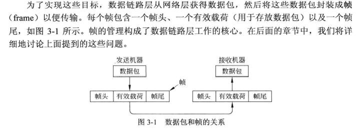
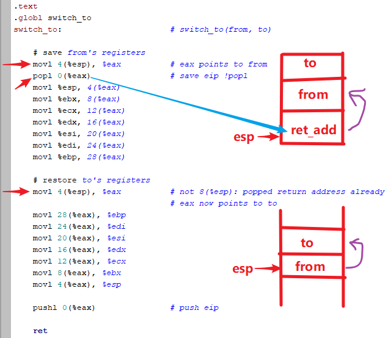
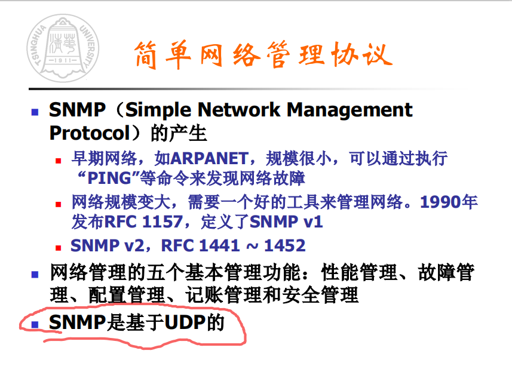
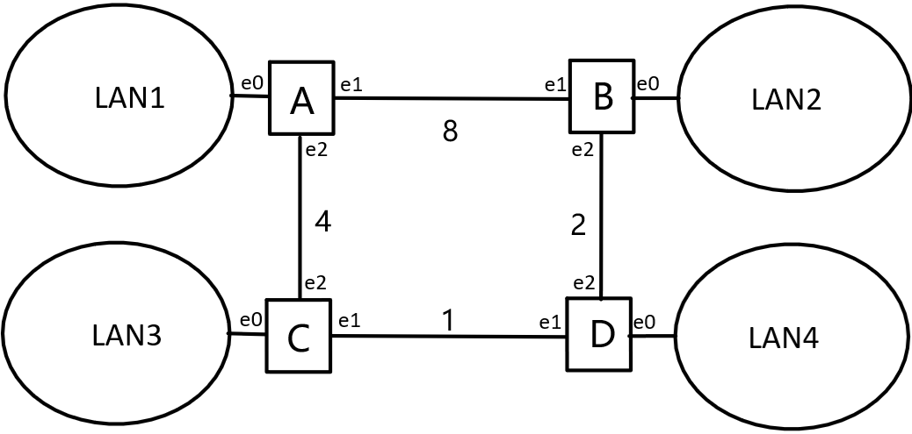
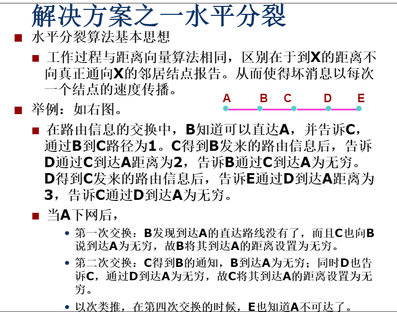

# 提示

所有解析均由本人做出解答，并不属于任何机构或其他个人及群体，同时并非官方解答，有可能存在纰漏错误，望后来者甄别并形成自己的思考。


# 2023年

## 数据结构（70'）

**1.判断题（2 x 8'）16分**

1. 向量只要在即将溢出前使容量加倍，并在装填因子不足 50% 时容量减半，便可保证消耗在容量调整的分摊时间复杂度为常数。
2. 插入排序可以实现为就地（in-place）算法。
3. 按照二叉搜索树规则在AVL树插入一个节点后，若造成失衡且在定位祖先三代节点 g，p，v 后，只需围绕g做一次旋转即可是局部恢复平衡，则在旋转之前节点 p 平衡因子不可能为零。
4. 对规模同为2023的AVL树和红黑树各做一次搜索，最坏情况下后者的搜索长度比前者更长。
5. 如果访问序列不能保持局部性，splay树未必还能保证分摊 $O(logn)$ 的时间性能。
6. 相对于 Kruskal 算法，Prim 算法更适宜用于稀疏图。
7. 存有 n 个词条的跳转表（skiplist）所占用的空间量在极端情况下会大于 $\Omega (n^2)$ 。
8. 只要存在负权边，则 Dijkstra 算法即便能够终止，所输出的也不是最短路径。

**2.填空题（4 x 6‘）24分**

1. 若某算法运行时间满足 **$T(n) = 128T(\frac{n}{2^{2023}}) +^{290}\sqrt{n}$** ，则$T(n)=$ <u>___</u>

2. 如下逆波兰式的值若为2023，则被遮挡的运算符应该是 <u>___</u>（考试卷子里运算符是涂黑的空格）

   | 0    | ！   | 1    | 2    | +    | 3    | 4    | +    |      | 5    | ！   | 6    | 7    | +    | 8    | -    | 9    | *    | +    | -    |
   | ---- | ---- | ---- | ---- | ---- | ---- | ---- | ---- | ---- | ---- | ---- | ---- | ---- | ---- | ---- | ---- | ---- | ---- | ---- | ---- |

   必须填写运算符及其对应中文（+ 加法、- 减法、* 乘法、/ 除法、 ^ 乘方、! 阶乘）

3. 若仅使用9个字符且出现频率分别为 {1，1，2，3，5，8，13，33，36}，则按照Huffman算法对长度为2023的随机字符串做编码，所需比特位数期望为 <u>___</u>

4. 在包含2023个节点的左式堆中，右子堆最多可能有 <u>___</u>个节点

5. 设文本串T，模式串P长度分别为2023和17，且T中不包含P，借助Boyer-Moore 算法坏字符表bc（好后缀表gs不用）来做模式匹配，最好情况下只需做 <u>___</u> 次字符比对

6. 采用独立链（Separate Chaining）法的某散列表长度为119，将2023个词条均匀插入散列表中，一次成功查找的过程中所需试探次数的期望值为 <u>___</u>


**3.计算题（10分）** 

采用Floyd算法将向量转换大顶堆依次给出三次下滤后的内容 

| k            | 0    | 1    | 2    | 3    | 4    | 5    | 6    | 7    | 8    | 9    | 10   | 11   | 12   | 13   | 14   |
| ------------ | ---- | ---- | ---- | ---- | ---- | ---- | ---- | ---- | ---- | ---- | ---- | ---- | ---- | ---- | ---- |
| 向量A[ k ]   | 3    | 8    | 0    | 6    | 1    | 13   | 11   | 2    | 9    | 5    | 4    | 14   | 7    | 10   | 12   |
| 第一次下滤后 |      |      |      |      |      |      |      |      |      |      |      |      |      |      |      |
| 第二次下滤后 |      |      |      |      |      |      |      |      |      |      |      |      |      |      |      |
| 第三次下滤后 |      |      |      |      |      |      |      |      |      |      |      |      |      |      |      |

只需写出每行不相同的内容，其他相同地方留白即可


**4.算法题（ 7'+ 10' + 3' ） 20分**
在以 r 为根的二叉树中，任一节点 v 与 r 之间通路上的所有节点（包括 r 及 v 本身）都成为 v 的祖先。如果节点 a 同时是节点 v 的和 u 的祖先，则称作 v 和 u 的公共祖先（当然 r 是所有节点的公共祖先）其中的深度最大值，称作最低公共祖先（Lowest Common Ancestor）

假定存在有 n 个节点的二叉树中，各节点的关键码都是取自$[0,n)$的正数，且彼此互异，尽管不能直接访问该树，但其先序，后序遍历序列已分别记录在数组 $P[0,n)$和 $Q[0,n)$中，试设计一个算法对$[0,n)$内的任意一对整数关键码 x 和 y，找出它们所对应节点的最低公共祖先 $LCA(x,y)$，要求算法的运行时间和辅助空间均不超过 $O(n)$

​		比如，若 $P=\{3,0,8,5,2,6,7,10,4,1,9\}$，$Q=\{5,8,2,0,10,4,7,9,1,6,3\}$，

​		则有$LCA(2,5)=0,LCA(8,4)=3,LCA(6,9)=6$

（1）试通过文字与图示，说明算法的原理

（2）试用伪代码描述算法的过程，并提供足够的注释

（3）试证明算法的时间，空间复杂度均符合要求


## 计算机组成原理（30’）

**1.判断题（1 x 5'） 5分**

1. 用补码表示的 32 位正数加法满足交换律（）
2. IEEE754 双精浮点数加法满足结合律（）
3. IO 端口和主存可以统一编址（）
4. 软件管理高速缓存 Cache 与主存储器地址之间的映射关系（）
5. 虚拟存储系统可以加快磁盘的存取速度（）

**2.填空题（2 x 5'） 10分**

1. 三位二进制数据 101 的带全局校验的海明码为  <u>___</u>。
2. 指令流水线冲突包括结构冲突，数据冲突和  <u>___</u>冲突。
3. 某 MIPS 采用标准 5 级流水线设计，且指令存储器和数据存储器分离。假设一个时钟周期就可以完成 5 级流水线中的任意阶段，同一周期内，寄存器堆写入寄存器的数据即可正确读出，执行下面的指令序列时：

  ```assembly
addi $2, $3, 4;		#3 号寄存器与 4 求和，存入 2 号寄存器
lw $2,0($2);		#装入 2 号寄存器指向的内存数据到 1 号寄存器
sub $4,$1,$5;		#1 号寄存器与 5 号寄存器求差，存入 4 号寄存器
and $6,$1,$3;		#1 号寄存器与 4 号寄存器求与，存入 5 号寄存器
  ```

  若处理器没有数据旁路，则至少需要插入 <u> ___</u> 个气泡,若有数据旁路，则至少需要插入 <u>___</u> 个气泡。

4. 某系统总线可在一个总线周期内并行传输 16 B 的数据，一个总线周期占用 3 个时钟周期，总线的时钟频率为 66 MHz，则总线带宽是 <u> ___</u>。

**3.选择题（2 x 5'） 10分**

1. 应用程序执行的过程中发生了中断或者异常，假设在指令 A 处发生了中断或者异常，以下描述正确的是（）
   A. 如果返回到该应用程序，则开始执行 A 的下一条指令
   B. 如果返回到该应用程序，则从指令 A 处开始执行（A 被再一次执行）
   C. 不会返回到该应用程序执行
   D. 以上都有可能
2. 5 级流水线处理器实现中，指令流经各个功能段的时间分别为 60 ns，50 ns，40 ns，60 ns，30 ns
   忽略流水线寄存器的延迟，则该处理器的时钟周期至少是（）
   A. 60 ns				B. 50 ns				C. 40 ns				D. 30 ns
3. 下列关于闪存及 FTL(Flash Translation Layer)的说法，错误的是（）
   A. 闪存的写入端粒度和擦除粒度不同
   B. 闪存每单元能编码的比特数越多，闪存的寿命越长
   C. FTL 提供逻辑块地址到物理块地址的映射
   D. 闪存物理页在更新之前要进行擦除

4. 以下关于通过 DMA 方式进行数据传输的描述，错误的是（）
   A. DMA 用于数据的快速传输，可用来代替中断方式
   B. DMA 控制器与 CPU 交替使用总线
   C. DMA 可以直接访问主存
   D. 数据传输过程由 DMA 自行控制
5. 以下字符描述错误的是（）
   A. ASCII 码使用一个字节进行编码
   B. UTF-8 码使用两个字节进行编码
   C. 字符编码不包括字符如何显示的信息
   D. 使用矢量字体的字符放大后不会失真

**4.计算题		5分**

分支预测包含了静态预测以及动态预测，在下面的 MIPS 程序中，计算不同预测方法下的预测准确率
（1） 采用静态预测，预测转移发生
（2）采用 1 位预测位，初始预测转移不发生
（3）采用 2 位预测位，初始预测转移不发生


```assembly
程序（$0 恒为 0）：
					addiu $8,$0,1		#$0 + 1→$8
					addiu $9,$0,0		#$0 + 1→$9

Loop:
					add $9,$9,$8		#$8 + $9→$9
					addi $8,$8,1		#$8 + 1→$8
					addi $1,$8,−1		#$8 − 1→$1
					slti $1,$1,100		#$1 < 100时$1 = 1, $1 ⩾ 100时$1 = 0
					bne $1,$0,loop		#若$1 ≠ $0 ,则 jump 到 loop
					nop					#空
```


## 操作系统（30‘）

**1.判断题（1 x 10'） 10分**

1. qemu-system-riscv64 可以模拟64位 riscv 处理机 并让操作系统在其上运行
2. 若应用程序执行中外设产生中断，则操作系统接管CPU控制权并完成中断处理
3. 进程是应用程序的一次执行过程
4. GDB调试不需要操作系统的服务来跟踪和中断被调试应用程序的执行
5. 信号量可用于实现同步（synchronization） 比如将信号量的初始值设为0，若线程A对此信号量执行一个P操作，那么该线程应当被阻塞睡眠
6. 操作系统中的文件系统必须具备打开文件、关闭文件、读文件、写文件的功能
7. 在没有MMU的CPU上 Linux内核可正常运行并具备基于页表机制的虚拟存储管理能力
8. 应用程序每次调用open()函数打开文件都要通过系统调用向操作系统提出请求
9. 在多核处理器中，采用用户线程实现多线程时，同一进程的多个线程可以并行执行
10. 在多处理器场景下控制中断的打开与关闭，可以保证只有一个线程进入临界区

**2.选择题（2 x 5'） 10分**

1. 下列组件不属于操作系统内核的是
   A. JavaScript解释器                       B. 文件系统              C. 中断处理例程          D. 进程调度器

2. 下列关于操作系统的描述中 错误的是
   A. 支持多核处理器的操作系统中允许多个执行程序并行执行
   B. 支持多核处理器的操作系统中允许多个执行程序并发执行
   C. 仅支持单核处理器的操作系统中允许多个执行程序并行执行
   D. 仅支持单核处理器的操作系统中允许多个执行程序并发执行

3. riscv处理器在U态（用户态）下执行ecall指令会陷入到S态（内核态）中 下列关于硬件会自动完成的操作中错误的是
   A. 保存进程的页面基址
   B. 保存ecall执行指令的所在地址
   C. 保存陷入原因“在U态执行ecall指令”
   D. 转跳到异常处理例程的入口地址

4. 下面有关进程切换错误的是
   A. 进程切换是来自两个不同进程在内核态中控制流之间的切换
   B. 进程切换的过程可以在内核态执行也可以在用户态执行
   C. 外设产生的中断会发生进程切换
   D. 进程切换的过程涉及到处理器中寄存器的保存于恢复

5. 下列关于fork()系统调用实现的说法错误的是
   A. 父子进程在返回到用户态的瞬间 都处于刚刚从一次系统调用返回的状态 但是二者的返回值不同
   B. fork()系统调用会创造一个不同于父进程的子进程的内核栈
   C. fork()系统调用会给子进程创造一个进程块，其中TrapContext部分的内容和父进程相同
   D. 父进程创建的子进程后 二者的进程ID一定不同

**3.问答题（10分）**

虚拟内存管理是操作系统中非常重要的组成部分，请回答以下问题

1.（3分）请阐述操作系统中虚拟内存管理的基本功能

2.（3分）请说明mmap()和munmap()系统调用的含义及基本实现机制

3.（4分）某32位处理机中虚拟页面存储方式的页面大小为4 KB，采用32位虚拟地址，34位物理地址，二级页表，每个页表包含1024项，页表项大小为4 B，请回答以下问题

A.请画图并简要描述虚拟地址转到物理地址的地址转换过程

B.请在图中标注和描述页表项各部分内容的含义和相关控制状态寄存器的作用


## 计算机网络（20’）

**1.判断题（1 x 5'） 5分**

1. 域名解析时递归查询不需要根服务器响应

2. 光网络只能通过有导向型介质传播

3. p-坚持型CSMA必须要使用时槽
4. 无线局域网面对暴露站可采用RTS/CTS机制解决
5. 中继器是物理层中的网络互连设备


**2.选择题（1 x 5'） 5分**

1. 以太网避免转发回路采用的技术是

   A   水平分裂    B  存储转发     C   指数退避         D  生成树

2. VLAN采用的技术是

   A 面向端口的VLAN技术     						   B    面向地址的VLAN技术    
   C   面向端口号的VLAN技术      					D  面向网络地址的VLAN技术

3. 邮件客户端发向服务器采用的协议是

   A	SMTP           B	POP3           C	ICMP         D	SNMP

4. DNS缓存会造成()

   A 可以提高响应性，没有一致性问题                    B 可以提高响应性，有一致性问题

   C 不能提高响应性，没有一致性问题                       D 不能提高响应性，有一致性问题

5. 下列不属于信道复用技术的是()

   A	频分复用         B	时分复用         C	码分复用          D	统计复用


**3.计算题（10分）**

链路中的最大速率可以发送10分组 / 秒  往返时间 1 秒，HTML网页文件被封装为10个分组，且包含有3个服务器端资源文件，封装在20个，30个，40个分组中

> 这应该是不是原题，应该是简化的意思：链路最大速率 10 个分组每秒，往返时延 1 秒，TCP 并发请求均大于 5，每个网页大小 10 个分组，其中包含 3 个服务器本地资源文件，资源文件可以分别通过第 20,30,40 个分组发送

1）（3分）使用 HTTP1.0时，用户下载本地资源和文件（所需要的时间为多少）最短响应时间多少

2）（3分）使用 HTTP1.1时，用户下载本地资源和文件（所需要的时间为多少）最短响应时间多少

3）（4分）使用 HTTP2.0 且 完成 3个服务器端资源文件下载时间为平均完成时间的标准值，用户下载本地资源和文件（所需要的时间为多少）最短响应时间多少

> 平均完成时间的标准值：即三个文件资源接收时间的平均值作为响应时间


# 2022年

## 数据结构(70‘)

**1.判断题（题号顺序可能不对）**

1. $\lfloor logn \rfloor! = O(nloglogn)$

   

2. 有序向量二路归并能在线性时间内完成，有序列表不能

   

3. 伸展树总体势能不可能超过 O(nlogn)

   

4. 左式堆兄弟子堆满足 L.height>=R.height

   

5. 对无向图某一节点 s 进行 dfs，若 dfs 树中 s 度数为 1，则 s 必不为关节点

   

6. 对于无向图，从任意顶点出发，进行 BFS，队列中的节点与起始节点距离均不大于 1

   

7. avl 树删除失衡后，经过调整，其高度可能不能保持原高度

   

8. 若 rb-tree 删除导致双黑修正进行了 Ω(logn)次重染色，则至少旋转一次

   

9. 希尔排序序列是${0, 1, 3, 5, 15, …, 2^{k-1}, …}$，时间复杂度是 $O(n^{3/2})$

   

10. 一棵伸展树经过访问后，节点被转换到根部，树的高度不一定降低

    

11. 如果 bm 算法仅使用 gs 策略而不使用 bc 策略则不能保证在最好情况下有 O(n/m)的时间复杂度（n 为文本串长度，m 为模式串长度）

    

12. kr 算法在匹配失败后无法在 O(1)内找到下一个


2.填空题

1）矩阵压缩，一个 50*50 的对称矩阵 a[0, 49] [0, 49]，每个数据占两个数据位，行优先的前提下压缩到矩阵下三角，a[0] [0]起始下标对应的是十进制的 1000，a[i] [j]的地址是 2000（i<=j），则 i=<u>___</u> ，j=<u>___</u> 

2）一个伸展树中所有节点都是偶数度，最深的叶节点需要经过 11 条边才能到达数根，则该二叉树最少有<u>___</u> 个节点

 3）由关键码{0, 1, 2, …, 10}组成，且所有节点都是偶数度的二叉搜索树，共有<u>___</u> 棵

 4）红黑树一条路经上有 5 个红节点，则树最少有<u>___</u> 个节点

 5）在有 400 个关键码的 20 阶 B-树，查找最大需要比较<u>___</u> 次


3.计算题

一个初始为空容量为 M =13 的哈希表 H，采用除留余数法寻址，采用双向平方试探法解决冲突，现插入如下数据，按格式填写下表（空桶不做标记）

| H[ ]    | 0    | 1    | 2    | 3    | 4    | 5    | 6    | 7    | 8    | 9    | 10   | 11   | 12   |
| ------- | ---- | ---- | ---- | ---- | ---- | ---- | ---- | ---- | ---- | ---- | ---- | ---- | ---- |
| 插入 44 |      |      |      |      |      |      |      |      |      |      |      |      |      |
| 插入 35 |      |      |      |      |      |      |      |      |      |      |      |      |      |
| 插入 18 |      |      |      |      |      |      |      |      |      |      |      |      |      |
| 插入 58 |      |      |      |      |      |      |      |      |      |      |      |      |      |
| 插入 71 |      |      |      |      |      |      |      |      |      |      |      |      |      |
| 插入 32 |      |      |      |      |      |      |      |      |      |      |      |      |      |
| 插入 84 |      |      |      |      |      |      |      |      |      |      |      |      |      |

如果此时插入 2021 会有什么效果？为什么？


4.算法分析题

已知任何一棵多叉树可以通过长子-兄弟法表示为二叉树，二叉树的层次遍历法也可用于多叉树，现给出二叉树节点定义如下：

```c++
struct BinNode {
int data;
BinNode *lc;
BinNode *rc;
};
```

请设计如下要求的遍历函数，并配合必要的注释：

```c++
void traverse(BinNode *x) {
//x 是二叉树 T 的根节点，T 对应为一棵多叉树 M 的长子-兄弟表示法
//要求输出全部节点的数值，遍历次序等价于 M 的层次遍历次序
//不可以使用递归，也不可以改变 T 的结构
//不得使用队列和栈以外的辅助数据结构
//时间和空间复杂度皆为 O(n)，n 为节点数量

}
```

1.说明该算法的原理

2.证明该算法的正确性

3.证明该算法的时间、空间复杂的为 O(n)


## 计算机组成原理(30')

**1.判断题**

1）流水线阶段寄存器对系统软件程序员是否是透明的

> 正确
>
> 透明的，流水线寄存器是流水线控制器设计者设计的，对程序员透明

2）静态存储器断电后是否会保存数据

> 错误
>
> ROM 断电后会保存数据，SRAM 是 RAM 的一种 RAM 断电之后数据就会丢失

3）中断处理是否会记录中断指令的 PC 值

> 正确
>
> MIPS指令里保存的是PC值，x86是保存PC+4，ARM指令集保存的是PC - 8

4）调整指令顺序是否会解决数据冲突（指令冲突？）

> 正确
>
> ‘对，也是解决数据冲突的方法之一

5）微程序是否是……（组合逻辑？为 xxxx 设计的？）一种机器语言程序（题干不全）

> 条件不足，无法判断


**2.选择题**

1） 关于 ALU 超前进位的描述正确的是：（选项不全）

A 简化什么来着？                 B 可以更快地获得进位         C 可以有更高的精度             D 进行逻辑运算？

>  答案：B，超前进位加法器是为了弥补行波（串行）行波进位加法器的性能，设计的目的是提前得到进位，后面的数位无需等待前面数位的计算结果
>
>  

2）关于层次存储系统的描述正确的是：

A 增加主存容量           B 实现时间局部性          C 实现空间局部性         D 提高计算机的性能

> 答案：D
>
> A 不对，并不是增加主存容量。
> B 和 C 不对，并不是实现了局部性，局部性不是层次存储器实现的，应该说层次储存器是利用了局
> 部性。
> D 对，提高了计算机访存的效率。

3） 关于 MIPS 系统内存缺页异常处理例程的描述正确的是：（题干貌似不全）

A 异常处理例程之前，硬件保存通用寄存器内容

B 异常处理例程之后，重新执行发生异常的指令

C 异常处理例程之后，执行发生异常的下一条指令

D 异常处理例程之后，软件恢复断点

> 

4） 关于 x86 和 MIPS 的描述正确的是：

A x86 指令集属于 RISC 指令集                   B x86 指令格式规整且等长

C MIPS 指令集属于 RISC 指令集                D MIPS 指令支持间接寻址方式

> 答案：C，x86 是 CISC，MIPS 是 RISC，CISC 指令格式不规整，MIPS 不支持间接寻址方式
>
> 但是其实 PPT 写的三种寻址方式有些笼统。实际上 R 型指令有寄存器寻址，I 型指令有是寄存器寻址、立即数寻址、相对寻址、基址或变址寻址。J 型指令是一种变通的直接寻址。（来自袁春风计算机组成与系统结构）
>
>   

5） 一个 32 位的总线系统，200 MHz，2 个时钟周期，总线的带宽是

A 200MB               B 400 MB               C 600 MB             D 800 MB

> 答案：B
>
> 直接套公式：4B × 200MHz/2 = 400MB/s


**3.填空题**

1） 补码表示的一个 4 字节的有符号整数的最大值是 0x <u>___</u>  （16 进制表示），IEEE 754 标准中的单精度浮点数的最大规约数在内存中表示为 0x <u>___</u>  （16 进制表示）。

> 答案：0,111,1111,1111,1111,1111,1111,1111,1111= 7FFFFFFF
>
> 符号位是 0，阶码是 254，尾数全 1，0,111,1111,0111,1111,1111,1111,1111,1111 = 7F7FFFFF
>
>  

2） 一个 32 位按字节编址的计算机，数据缓存的缓存行的大小位 8B，缓存行有 4 个，缓存状态初始为无效，现执行一个程序，依次访问 0x100，0x110，0x120，0x130，0x100，0x110，0x120，0x130，若为直接映射，命中次数为<u>___</u> ，若为全相联，采用 LRU 替换策略，命中次数为<u>___</u> 。

> 直接映射地址结构为：标记位+索引位+块内地址
> 缓存行 8B，所以块内地址 3 位，缓存行有 4 个，缓存行号 2 位
> 0x100 写成二进制 0001,0000,0000 行号是 00
> 0x110 写成二进制 0001,0001,0000 行号是 10
> 0x120 写成二进制 0001,0010,0000 行号是 00
> 0x130 写成二进制 0001,0011,0000 行号是 10
> 访问 0x100 未命中，把对应的块搬运到缓存的第 00 行
> 访问 0x110 未命中，把对应的块搬运到缓存的第 10 行
> 访问 0x120 未命中，把对应的块搬运到缓存的第 00 行
> 访问 0x130 未命中，把对应的块搬运到缓存的第 10 行
> 访问 0x100 未命中，把对应的块搬运到缓存的第 00 行
> 访问 0x110 未命中，把对应的块搬运到缓存的第 10 行
> 访问 0x120 未命中，把对应的块搬运到缓存的第 00 行
> 访问 0x130 未命中，把对应的块搬运到缓存的第 10 行
> 命中次数为 0
> 全相联地址结构为：标记位+块内地址
> 访问 0x100 未命中，把对应的块搬运到缓存的第 00 行
> 访问 0x110 未命中，把对应的块搬运到缓存的第 01 行
> 访问 0x120 未命中，把对应的块搬运到缓存的第 10 行
> 访问 0x130 未命中，把对应的块搬运到缓存的第 11 行
> 访问 0x100 命中，访问 0x110 命中，访问 0x120 命中，访问 0x130 命中
> 一共命中 4 次
> 怀疑题目有问题？LRU 替换算法完全用不上？

3） 一个 4+1 的 RAID5 磁盘组织，同一个地址在前四个磁盘中的数据分别为 0x11，0x22，0x33，0x44，此时第五个磁盘出错，新磁盘替换后，新磁盘中该地址上的数据初始化为<u>___</u> 。

> 0x11 = 0001,0001
> 0x22 = 0010,0010
> 0x33 = 0011,0011
> 0x44 = 0100,0100
> 以上四个数据做异或操作：
> 0001,0001 和 0010,0010 异或得到 0011,0011
> 0011,0011 和 0011,0011 异或得到 0000,0000
> 0000,0000 和 0100,0100 异或得到 0100,0100
> 所以第 5 个盘对应的数据初始化为 0x44
>
> 
>
> 


**4.计算题**

一个五级流水的 MIPS，L1 cache 采用指令缓存和数据缓存分别存放，可在一个时钟周期内完成缓存读写（与寄存器时钟周期同步），现有如下指令已经存入缓存：

```assembly
lw r1 0(r2); 		r1 <- mem[r2]
sub r4 r1 r5; 		r4 <- r1 – r5
and r6 r1 r7; 		r6 <- r1 & r7
or r8 r1 r6; 		r8 <- r1 | r6
```

1） 在无数据旁路的情况下，有多少指令会产生数据冲突？需要多少个时钟周期完成这些指令？

| 指令            | CC1  | CC2  | CC3  | CC4  | CC5  | CC6  | CC7  | CC8  |
| --------------- | ---- | ---- | ---- | ---- | ---- | ---- | ---- | ---- |
| Lw    R1 0(R2)  | IF   | ID   | EXE  | MEM  | WB   |      |      |      |
| Sub  R4 R1 R5   |      | IF   | ID   | EXE  | MEM  | WB   |      |      |
| And  R6 R5 R4   |      |      | IF   | ID   | EXE  | MEM  | WB   |      |
| Or     R8 R1 R6 |      |      |      | IF   | ID   | EXE  | MEM  | WB   |

> 无数据旁路的情况下：
>
> 从上表可以看出
> (1)Lw R1 0(R2)和 Sub R4 R1 R5 存在数据冲突，CC5 的时候,Lw R1 0(R2)才把数据存到 R1 里，而
> Sub R4 R1 R5 在 CC3 的时候就要取 R1 的值。
> (2)Sub R4 R1 R5 和 And R6 R5 R4 存在数据冲突，CC6 的时候 Sub R4 R1 R5 把数据存到 R4 里，而
> And R6 R5 R4 在 CC4 的时候就要用 R4 的值。
> (3)And R6 R5 R4 和 Or R8 R1 R6 存在数据冲突，CC7 的时候 And R6 R5 R4 把数据存到 R6 里，而
> Or R8 R1 R6 在 CC5 的时候就要用 R6 的值。
> 另外要注意 Lw R1 0(R2)和 Or R8 R1 R6 并不冲突，因为在 CC5 的时候寄存器可以前写后读.
> 所以在无数据旁路的情况下，有“三对”指令（一共四条）产生数据冲突，需要 14 个时钟周期完
> 成这些指令.具体暂停情况如下表：

| 指令            | CC1  | CC2  | CC3  | CC4  | CC5  | CC6  | CC7  | CC8  | CC9  | CC10 | CC11 | CC12 | CC13 | CC14 |
| --------------- | ---- | ---- | ---- | ---- | ---- | ---- | ---- | ---- | ---- | ---- | ---- | ---- | ---- | ---- |
| Lw    R1 0(R2)  | IF   | ID   | EXE  | MEM  | WB   |      |      |      |      |      |      |      |      |      |
| Sub  R4 R1 R5   |      | IF   |      |      | ID   | EXE  | MEM  | WB   |      |      |      |      |      |      |
| And  R6 R5 R4   |      |      |      |      | IF   |      |      | ID   | EXE  | MEM  | WB   |      |      |      |
| Or     R8 R1 R6 |      |      |      |      |      |      |      | IF   |      |      | ID   | EXE  | MEM  | WB   |

2） 在有数据旁路的情况下，需要多少个时钟周期完成这些指令？需要插入多少个气泡？请说明原因。

| 指令            | CC1  | CC2  | CC3  | CC4       | CC5  | CC6  | CC7  | CC8  | CC9  |
| --------------- | ---- | ---- | ---- | --------- | ---- | ---- | ---- | ---- | ---- |
| Lw    R1 0(R2)  | IF   | ID   | EXE  | MEM       | WB   |      |      |      |      |
| Sub  R4 R1 R5   |      | IF   | ID   | ==Stall== | EXE  | MEM  | WB   |      |      |
| And  R6 R5 R4   |      |      | IF   | ==Stall== | ID   | EXE  | MEM  | WB   |      |
| Or     R8 R1 R6 |      |      |      | ==Stall== | IF   | ID   | EXE  | MEM  | WB   |

> 如果有数据旁路，需要9个时钟周期完成这些指令，需要插入 3 个气泡，因为对于数据装入之后立即使用会产生数据冲突的情况，在有数据旁路的条件下也不能通过数据旁路来解决所有的数据冲突，此时必须暂停依赖于load的指令，等装入数据之后进行数据旁路（前传）
>
> 只有 load-use 指令需要暂停流水线。
>
> 

> 其实就是 ppt 原题基本上，就是寄存器稍微有点变化指令都没变，可以看出 PPT 还是很重要的
>
> 
>
> 
>
> 从本质上讲，其实是插入一个气泡，一个气泡干了三个事，但是感觉答案应该就是插入三个气泡，
> 觉得不稳妥的可以写出你的理解，然后说是一个气泡还是三个气泡


## 操作系统(30')

1.判断题

1） 在单核 CPU 中，进程可以通过屏蔽/使能硬件中断中的机器指令来实现同步互斥

> 正确
>
>  

2） 用信号量可以实现管程

> 正确
>
> 管程和信号量是等价的，用管程可以实现信号量，也可以用信号量实现管程，管程对开发者更友好
>
> 信号量由一个整型变量sem和两个原子操作PV组成，管程为了解决信号量在临界区PV操作上配对的麻烦，把配对的PV操作集中在一起，生成一种新的并发编程的方法。
>
>  

3） 在 shell 中输入”ls | more”，shell 会建立两个子进程，并在这两个进程之间建立管道（pipe）

> 正确
>
>  

4） 当进程用完所有虚拟地址空间后，多级页表比一级页表所占的内存空间大

> 错误
>
> 从页表性质来看，保存在主存中的页表承担的职责是将虚拟地址翻译成物理地址；假如虚拟地址在页表中找不到对应的页表项，操作系统就不能正常工作。所以页表一定要覆盖全部虚拟地址空间，而一级页表在覆盖内存全部虚拟地址空间后，二级页表可以在需要时创建，由于多级内存可以不保存在内存中，故所占内存空间有可能比一级页表更小。

5） 先来先服务算法（FCFS）可以解决进程间死锁的问题

> 错误
>
> 先来先服务算法会造成饥饿，不能解决进程间死锁问题

6） 在 linux 操作系统中，把外设表示成文件，让应用程序以文件操作的形式来访问外设

>  正确

7） 在一个硬盘中可以存在多种不同的文件系统

> 正确
>
> 可以设置不同的文件系统

8） 通过页表机制可以实现进程间共享内存

> 正确，使页表项对应相应物理地址即可实现
>
>  操作系统概念也有提及：

9） 外部设备产生中断后，操作系统一定会响应中断

> 错误
>
> 当I/O设备向CPU发来中断信号，CPU在收到中断信号以后，并不立即执行响应，而是在执行每条指令周期的最后-一个时钟周期，一旦检测到中断信号有效，并且中断允许位置1的时候，CPU才 在当前指令执行完以后转入中断响应周期。

10） 最优页面置换算法（OPT）属于栈式算法（Stack），存在 Belady 异常现象

> 错误
>
> 栈结构算法不会出现belady异常


**2.填空题**

反置页表的每一个页表项中存在 <u> ①</u> 、 <u>②</u> 、 <u>③</u> 和 hash 冲突页表项链表指针。在反置页表地址转换的过程中，hash 函数的输入是 <u>④</u> 和 <u>⑤</u> ，输出用作 <u>⑥</u> 。如果页表项中的内容和 hash 函数的输入不一致，则会出现 <u>⑦</u> 。

A 进程控制块 B 文件标识符 C hash 冲突 D 标志位 E 物理页号 F 虚拟页号 G 进程 ID

>  反置页表的每一个页表项中存在 <u>  ① D 标志位__</u> 、<u> ② E  虚拟页号___</u> 、 <u>③ G_进程ID__</u> 和 hash 冲突页表项链表指针。在反置页表地址转换的过程中，hash 函数的输入是 <u>④ E  虚拟页号___</u> 和 <u>⑤ G_进程ID__</u> ，输出用作 <u>⑥ E 物理页号__</u> 。如果页表项中的内容和 hash 函数的输入不一致，则会出现 <u>⑦ C hash冲突__</u> 。
>
> 


**3.简答题**

以下是一个软件同步算法的伪代码，要求支持线程 p[0]和 p[1]的临界区访问

1） 解释该代码的原理

2） 完成填空，配合必要的注释

```c
variables:
		wants_to_enter: array of two booleans
		turn: integer
	wants_to_enter[0] <- false
	wants_to_enter[1] <- false
	turn <- 0 // or 1
```

线程 p[i]的算法伪代码（i 的值取为 0 或 1）：

```c
wants_to_enter[i] <- 1.___
while(wants_to_enter[ 2.___ ]) {
	if (turn 3.___ i) {
			wants_to_enter[i] <- 4.___
			while(turn 5.___ i) {
			// busy wait
		}
		wants_to_enter[i] <- 6.___
	}
}
```

临界区代码：

```c
critical_section();
turn <- 7.___ 
wants_to_enter[i] <- 8.___
// remained section
```

>   
>
> 1）算法原理：Dekkers 算法思想：**孔融让梨**，任意进程在访问关键区之前会先检查其它进程是否也需要使用关键区，如果其它进程也需要使用关键区，并且其它进程也拥有执行权限，这时当前进程就会等待其它进程访问关键区完毕，若其它进程无法同时满足两个条件，那么当前进程就会直接访问关键区域。

2）代码实现如下：

```c
variables:
		wants_to_enter: array of two booleans
		turn: integer
	wants_to_enter[0] <- false
	wants_to_enter[1] <- false
	turn <- 0 // or 1
//线程 p[i]的算法伪代码（i 的值取为 0 或 1）
wants_to_enter[i] <- 1.___true
while(wants_to_enter[ 2.___j ]) {
	if (turn 3.___!= i) {
			wants_to_enter[i] <- 4.___false
			while(turn 5.___!= i) {
			// busy wait
		}
		wants_to_enter[i] <- 6.___true 
	}
}
//临界区代码：
critical_esction():
turn <- 7.___j 
wants_to_enter[i] <- 8.___false 
//remained section
//这里的 i==0 当且仅当 j==1，i==1 当且仅当 j==0
```


## 计算机网络(20')

1.填空题

1） 海明纠错码，纠正 n 个字节错误，海明纠错码的最短码距是<u>___</u> 

> 答案：2n + 1
>
>  

2） ISO/OSI 模型中的<u>___</u>层会在处理协议元数据的时候在数据首尾添加信息

>  答案：数据链路层
>
> 

3） IEEE 802.3 局域网中使用的 MAC 协议是<u>___</u> 

> 答案：CSMA/CD
>
>  

4） 166.111.67.8/21 的广播地址是<u>___</u> 

> 答案：166.111.71.255
>
> 166.111.01000011.8，网络号部分是 166.111.01000
> 广播地址为 166.111.01000111.255 即 166.111.71.255

5） TCP 中<u>___</u>与定时器结合释放连接

> 答案：三次握手
>
>  


2.选择题

1） 以下哪一个属于使用了时槽周期的 MAC 协议

A 非坚持型 CSMA        B 1-坚持型 CSMA        C p-坚持型 CSMA     D 纯 ALOHA

>  答案：C
>
>   
>
> 

2） 链路层成帧的方法不包括

A 偏移量法           B 物理层编码违例法               C 带位填充首尾字节标记法             D 字符计数法

>  答案：A
>
>  

3） 哪一个网络设备工作在网络层

A 集线器           B 路由器                 C 网桥             D 中继器

>  答案：B
>
>  

4） 距离矢量算法被用于以下哪种网络路由协议

A OSPF                  B IS-IS                  C BFG                D RIP

> 答案：D
>
>  

5） 电路交换和虚电路分组交换共同点

I. 分组有序       II. 设备端口带宽预约占用        III. 不会产生拥塞

A I、II、III              B I、II             C I、III             D I

> 答案：D
>
> 电路交换特点：1、需要建立连接 2、独占带宽 3、不会产生拥塞
>
> 虚电路分组交换特点：1、需要建立连接 2、非独占带宽  3、会产生拥塞
>
>  


3.计算题

网络设备 S 和主机 A、主机 B、主机 C 相连形成局域网，S 的每个接口 1000 帧每秒，每帧承载有效载荷 1 KB，数据帧处理只考虑转发时间，每条链路一样长，发送延迟 2 ms，链路上无误码，ACK 帧不计算处理和转发的时间，每个主机采用滑动窗口控制拥塞，发送接收拥塞窗口大小单位为帧。


1） A 发送窗口大小为 1，A 向 C 发送足够多的数据（稳定发送），当 S 为集线器或转发存储交换机时，与 A 相连的链路效率分别为多少？

> 集线器所有端口使用同一根总线，所有站处于一个冲突域，只能进行串行传输，转发存储式交换机每个端口有独立的冲突域，可以进行并行传输
>
> 故当S为集线器时，与A相连的链路效率为1000帧/s，当S为转发存储交换机时，与A相连的链路效率为1000帧/s


> A 的发送速率为 <font size="5">$\frac{1帧}{2ms}=\frac{1帧}{0.002s}= 500 帧/𝑠$</font>，链路效率为<font size="5">$\frac{500}{1000} = 0.5$</font>
>
> 就是 A 发送一帧之后，得等到 2 ms 才能得到确认，再发下一个帧，这个速率是 500 帧/s

2） 若 S 为全双工交换机，A 向 C 发送 30 KB 数据，若要做到最快且无拥塞，A 发送窗口最小为多少？最短需要多久？

> 要达到最快且无拥塞的情况，A 发送窗口最小需要能容纳 30 帧数据。
>
> 总帧数=总数据量每帧有效载荷大小=30 KB1 KB/帧=30 帧总帧数=每帧有效载荷大小总数据量=1 KB/帧30 KB=30 帧
>
> 发送 30 帧数据所需的时间为：
>
> 发送时间=总帧数传输速率=301000 秒=0.03 秒=30 毫秒发送时间=传输速率总帧数=100030 秒=0.03 秒=30 毫秒

3） 若 S 为全双工交换机，每个发送/接收接口都有 4 帧缓存，A、B 都向 C 发送数据，保证两条链路公平，若要不产生拥塞丢失，A 和 B 的拥塞窗口最大为多少？

> 在这种情况下，我们需要考虑缓存大小和链路容量，以避免拥塞。
>
> 根据流控方程：
>
> 2w=4传输时延2*W*=传输时延4
>
> 传输时延包括发送时延和传播时延。发送时延可以用以下公式计算：
>
> 发送时延=窗口大小传输速率发送时延=传输速率窗口大小
>
> 传播时延为 2 ms。
>
> 代入数值，我们可以解得拥w塞窗口大小 W。
>
> w=42×10−3−30×10−3=4−28×10−3≈−142.86*W*=2×10−3−30×10−34=−28×10−34≈−142.86
>
> 由于拥塞窗口大小不能为负数，这说明网络配置无法满足要求。


---


# 2021年

## 数据结构(70**'**)

1.渐进复杂度（12分，6分1个）

A）考察复杂度函数<font size="4">$f(n)=2^{log^2(n)}$，$g(n)=n^{2020}$</font>，从渐进意义上，谁增长的更快，说明理由（6分）


B）若复杂度函数f(n)满足：<font size="4">$f(0)=f(1)=O(1)$</font>，且对于n ≥ 2 满足递推式：<font size="5">$f(n)=3 × f(\frac{n}{9})+O(1)$</font>，则就大O记号而言，问f(n) 渐进意义上属于哪个复杂度层次，说明理由（6分）


2.计算（12分，6分1个）

A）（6分）考察加（+）、减（-）、乘（*）、除（/）、乘方（^）、阶乘（!）运算，试将中缀表达式“ ( 0 ! + 1 ) * 2 ^ ( 3 ! + 4 ) - ( 5 ! / 6 + ( 7 - ( 8 - 9 ) ) ) ”转换为逆波兰表达式，并按如下格式分段填写

|      |      |      |      |      |      |      |      |      |      |      |      |      |      |      |      |      |      |      |      |
| ---- | ---- | ---- | ---- | ---- | ---- | ---- | ---- | ---- | ---- | ---- | ---- | ---- | ---- | ---- | ---- | ---- | ---- | ---- | ---- |


B）（6分）试按如下格式，分别给出下面模式串对应的next[ ]表和改进后的next[ ]表

| **j**                 | 0     | 1     | 2     | 3     | 4     | 5     | 6     | 7     | 8     | 9     | 10    | 11    | 12    |
| --------------------- | ----- | ----- | ----- | ----- | ----- | ----- | ----- | ----- | ----- | ----- | ----- | ----- | ----- |
| **p[ j ]**            | **R** | **V** | **M** | **M** | **O** | **R** | **E** | **O** | **T** | **R** | **V** | **M** | **P** |
| **next[ j ]**         | -1    |       |       |       |       |       |       |       |       |       |       |       |       |
| **改进后的next[ j ]** | -1    |       |       |       |       |       |       |       |       |       |       |       |       |


3.快速排序 + 插入排序（7分）

考察对Quicksort算法的如下调整：任何子序列在规模缩减至m以下之后使不再继续递归划分；待所有递归都已终止后，再对整个序列调用一次Insertionsort，如果待排序序列总长为n，那么Insertionsort需要花费多长时间？为什么？

> 由题意知，快速排序每次都将序列规模划分到m之内就不再划分，改为对全局用插入排序，问算法复杂度


4.AVL树（14分）

我们知道，AVL树在删除一个节点后如果失衡，可以通过适当的调整来恢复平衡。

A)为确定应在何处以何种方式完成这样的调整，我们需要在某相邻的三层中确定三个节点，并按高度递减次序分别命名为g，p，v试说明在算法中是如何找到他们的。（4分）

B)如果将各种调整的方式统一为“（ 3 + 4 ）—重构”，那么在调用connect34(a,b,c,T0,T1,T2,T3)时，七个参数共有多少种可能的情况？（2分）

C)试按如下表格形式，逐行地列举出这些情况，表格如下（顺序先后无所谓）（8分）

| 可能的情况 | a    | b    | c    | T0   | T1   | T2   | T3   |
| ---------- | ---- | ---- | ---- | ---- | ---- | ---- | ---- |
| #1         |      |      |      |      |      |      |      |
| #2         |      |      |      |      |      |      |      |
| ......     |      |      |      |      |      |      |      |


5.深度优先搜索 + 拓扑排序（10分）

对任一有向无环图做DFS后，所有节点按照回溯逆序排列是否一定得到拓扑排序，如果是尝试证明它或者举出反例（10分）


6.算法题（13分）

设二叉搜索树（Binary Search Tree）的节点定义如下：

```c++
struct BstNode{
	int	key;	//关键码
	BstNode	*parent;	//父节点
	BstNode	*lc;	//左孩子
	BstNode	*rc;	//右孩子
	int size;	//当前节点及其后代的综述
```

（1）使用伪代码完成以下算法，并提供足够的注释说明：（8分）

```c
int count(BstNode *T, int lo, int hi){	//lo
	//在以T为根的二叉搜索树中，统计出关键码在[lo,hi)区间内的节点总数
	//无论统计出的总数有多大，时间复杂度均不得超过O(h)，其中h为全树高度
	//除了作为输入的这棵树，只能使用O(1)的辅助空间
} 
```

（2）试说明算法的原理及正确性（5分）

（3）试证明算法的时间、空间复杂度均符合要求（3分）


## 计算机组成原理(30**'**)

判断（5分）

1.在字符的编码中蕴含了字符如何表示的信息

2.在相同Cache 缓存容量⼀定的话，全相连组织方式的命中率不低于组相连方式的命中率。

3.引入虚拟内存的目的是提高内存的访问速度

4.虚拟地址到物理地址的转换关系由软件维护

5.DMA设备不能独占使用内存总线周期


选择（10分）

1.IEEE单精度浮点数表示的范围（   ）

A.正数的个数比负数的个数多                             B.负数的个数比正数的个数多      

C.正数的个数和负数的个数⼀样多                     D.依据实现有不同的情况


2.执行相同程序的同⼀条指令，以下四个处理器所需要时间最短的是（   ）

A.处理器1频率是3 GHz，CPI = 1.5               B.处理器2频率是2.5 GHz， CPI  = 1.0          

C.处理器3频率是4 GHz，CPI = 2.2               D.处理器4频率是2.8 GHz， CPI = 1.1


3.下列信号的值无关于IW指令（从内存中加载值到寄存器）功能实现的是

A.PC寄存器的输出到指令内存的输入                                 B.寄存器的输出到ALU的输入

C.ALU计算结果输出到寄存器文件的输入                           D.ALU计算结果输出到数据内存的输入


4.关于TLB的功能，以下说法正确的是（   ）

A.TLB把应用程序访问的数据缓存到CPU中              B.TLB缺失之后能够在指令cache中找到相应的内容

C.TLB缺失之后会引发程序错误                                 D.TLB缓存了虚拟地址到物理地址的映射关系


5.不可用于解决流水线数据冲突的是（   ）

A.流水线延迟（即阻塞）        B.数据前传（即旁路）        C.分支预测        D.动态调度/编译器调度


填空

1.采用补码表示的short类型数据，存放在内存中的连续2个字节单元，其值分别为0xFFH（低字节）和0x01H（高字节），如果是小端表示的机器，则其十进制值为<u>___</u> ，如果是大端表示的机器，则其十进制值为<u>___</u> 。

2.某按字节编址的计算机层次存储系统，地址位数为32位，缓存的大小为8字节，采用二路组相连的方式，块内8字节，索引的位数为<u>___</u> 位，标记位为<u>___</u> 位。

3.冯诺依曼计算机的最主要特征是<u>___</u>。


4.计算

假如使用标准5级流水线MIPS CPU，执行下面的程序段，请回答：

```assembly
LW	R4 0(R5);	#将（R5）的值读入到R4
ADD R6 R4 R3;	#R6 = R4 + R7
SUB R8 R5 R9;	#R8 = R5  - R9
```

(1) 指出会发生数据冲突的指令和寄存器？（2分）

(2) 如果CPU中没有实现数据转发，即不加数据旁路的情况下正确执行完程序段至少需要阻塞几个周期？

(3) 增加数据旁路至少需要阻塞几个时钟周期，并指出每个数据冲突中被转发的寄存器值来源于哪个阶段寄存器。


## 操作系统(30**'**)

判断:

1.clock算法可以通过修改和读取页表中的访问位实现

2.在用了银行家算法时，系统在不安全状态下会出现死锁

3.每个进程有且仅有一个PCB

4.可以通过改变某个寄存器位的方式停止时钟中断

5.如果系统中有M个进程，那处于就绪队列中的进程数最多为M-1

6.如果一个父进程在有许多子进程的状态下退出了,它的子进程将变为僵尸进程。

填空

简答题

简答:

操作系统中通信可以使用消息队列、信号、信号量、管道,说明下列操作中最适合使用哪种通信机制,并解释为什么

1）输入指令关闭一个进程(是不是关闭进程不太确定)

2）linux指令"catfile|grepexam”

3）第一个进程对一段数据进行写入,另一个进程基于写入的数据对其进行排序


## 计算机网络(20**'**)

选择

1.传输层服务访问点是

A. IP地址，端口号              B.忘了              C. MAC地址，IP地址，端口号                  D. MAC地址，IP地址


2.CSMA/CD的链路,数据传输率是1 Gbps,数据传播速率200000 km/s问最小帧长增加50个字节后，最远两节点间距离应该

A.增加40m          B.减少40m          C.增加80m            D.减少80m


3.循环余码的多项式为x^2 + x + 1时下列哪个是对的

A.具体数记不清了      B.        C.        D.


4.下列正确的是.同一个域名可以拥有多个IP地址.同一个IP地址可以拥有多个域名

AI       B.II         C.都对       D.都不对


大题

和这个题图一样,不过数不一样,求C的路由表

1）如果c使用链路装调路由算法,则C的发送的链路状态信息是?

2）依据上图，每个路由器连接一个子网，每个子网内依次有 90，78，4，15，3，40，2（数是编的不过应该差不多）给了一个子网为55.16.22.0/24(也是编的，知道/24就行) 求一个合理的子网划分，写出每个子网的范围和对应子网掩码

3）最后一道大题似乎是和滑动窗口协议相关的(没做完没来得及读题QAQ.·写数据结构去了)


---

# 2020年

## 数据结构(70**'**)

**判断(12×2')**

1. (logn)^n= θ(n^logn)。

   > 错误。等式两边同时取log：左边=n*loglogn，右边=logn * logn；从渐进复杂度的层次来看：n * loglogn > n = n^0.5 * n^0.5 > logn*logn，即有左边 > 右边。

2. 快速排序的时间复杂度在平均情况下为O(nlogn)，最好情况亦如此。

   > 正确。快速排序最好O(nlogn)，最坏O(n^2)，平均O(nlogn)。详情请参考邓书12.1.5节：快速排序复杂度。

3. 败者树删除的时间复杂度在常系数上优于胜者树。

   > 正确。在删除的过程中胜者树须交替访问沿途节点及其兄弟，而败者树在节点上升的过程中只需与父节点进行比较。两者复杂度均为O(logn)，在常系数上败者树优于胜者树。以下图片来源于邓老师讲义：
   >
   > 

4. 完全二叉堆删除操作平均时间复杂度为O(1),最坏情况下为O(logn)。

   > 错误。删除元素需要用下滤操作，该下滤在平均情况下的时间复杂度为O(logn)。另外，需要注意的是，在完全二叉堆中插入元素需要进行上滤操作，其时间复杂度在平均情况下为O(1)，详情可参考邓习题10-6。

5. 采用crane算法将左式堆A和B合并为左式堆H，则H右侧链上的节点未必都来自A或者B的右侧链。

   > 正确。下图中的swapped操作会交换左侧节点和右侧节点。图片来自于邓书10.3节：
   >
   > 

6. 规模为n的AVL一次插入操作最坏情况下会引起logn次局部重构。

   > 错误。AVL树的删除操作在最坏情况下会引起logn次局部重构，插入操作则不会。详情可参考邓书《数据结构》7.4.2节—AVL树节点插入：
   >
   > 

7. 将n个元素组成一个完全二叉堆，时间复杂度至少为O(nlogn)。

   > 错误。利用 floyd 建堆算法可将时间复杂度降至O(n)。详情可参考邓书10.2.4节中的floyd建堆算法。

8. 红黑树上所有节点的黑深度和黑高度之和必相等。

   > 错误。红黑树必须满足条件：从任一外部节点到根节点的沿途，黑节点的数目相等。对于黑节点来说，其黑高度+黑深度=全树的黑高度；对于红节点来说，其黑高度+黑深度=全树的黑高度-1。具体地，黑高度和黑深度的定义见以下邓书截图：
   >
   > 

9. 基于比较式的算法可以在O(n)时间内在任意n个无序整数中找出前10%。

   > 正确。在邓书的12.2.6节中介绍了一种在最坏情况下运行时间依然为O(n)的 k-选取算法。本题中，令k=n*10%即可。

10. 开放式散列比封闭式散列可以更有效地利用局部缓存。

    > 错误。封闭式散列可用的散列地址仅限于散列表所覆盖的范围之内，能保证物理上的关联性，因此可以更有效地利用局部缓存。而开放式散列使用的策略如独立链等引入了次级关联，因而不能保证物理上的关联性。详情可参考邓书9.3.5节和9.3.6节。

11. 有向图DFS后有k条边被标记为后向边，图中未必恰含k个环路。

    > 正确。如下图，从B开始访问，只有一条后向边，但图中有两个环路。有向图的DFS算法详情请参考邓书6.7节。
    >
    > 

12. 在n个节点的跳转表中，单个词条的期望塔高是θ(logn)。

> 错误。各塔高度符合几何分布，期望塔高E(h)=2。详情请参考邓老师ppt：
>
> 


**选择(7×2')**

1.有向无环图DFS后各节点按（  ）构成拓扑排序

A. 被发现的顺序             B. 被发现的逆序           C. 回溯的顺序                D. 回溯的逆序

> 回溯的逆序。对于一个有向无环图中的A节点，当DFS回溯到A时，说明A的子节点均已被访问完毕，而在拓扑排序中A节点应该位于其子节点之前。所以DFS回溯的逆序对应拓扑排序。详情请参考邓书6.8.3节中的拓扑排序算法。


2.若底层排序算法不稳定，采用基数排序算法后（  ）

A.未必正确并且不稳定           B.正确并且不稳定        C.未必正确并且稳定             D.正确并且稳定

> 未必正确并且不稳定。举个例子：对{71,72}进行基础排序，首先按照个位数排序结果为{71,72}；然后按照十位数进行排序，因为十位都是7相等，如果底层排序算法不稳定，很可能出现排序结果为{72,71}的错误结果。


3.随机英文字母串匹配，最好情况下蛮力           KMP，平均复杂度蛮力           KMP（  ）

A.坏于 坏于           B.相等 坏于        C.坏于 相等             D.相等 相等

> 相等 相等。字符集较大时，蛮力算法的平均复杂度为O(m+n)，与KMP算法相差无几。具体可参考邓书习题11-9和11-10。


4.逆波兰表达式0!1+23!4+^ * 56!7 * 8!?/-9+值为2017（  ）

A.?处为加号          B?处为减号        C.?处为乘号           D.?处为除号

> 除号。逆波兰表达式的计算过程：操作数入栈；遇到操作符时，操作数出栈，求值，将结果入栈；当结束后，栈顶就是表达式的值。本题将选项带入逆波兰表达式中进行计算即可确认答案为除号。


5.（  ）个无差别节点构成的真二叉树，与由2019对括号构成的合法表达式一样多

A.2018           B.2019        C.4038            D.4039

> 4039。在括号表达式中，将'('看作是入栈操作，')'看作是出栈操作。一个合法的括号表达式对应一种栈混洗。因此2019对括号的匹配对应于2019个元素的栈混洗，合法表达式数量为f(2019)是卡特兰数。
>
> 由2019个非叶子节点构成的真二叉树的种数记为g(2019)。其左子树中非叶子节点数可以是0,1,2等，与此对应的右子树的非叶子节点规模分别为2018,2017,2016等。因此有等式g(2019)=g(0)*g(2018)+g(1)*g(2017)+……+g(2018)*g(0)。另外g(0)=g(1)=1，所以g(2019)也是卡特兰数。2019个非叶子节点的真二叉树中共有2019*2+1=4039个节点，答案是4039。


6.9个字符出现频率为0,1,1,2,3,5,8,13,21，其哈夫曼编码（  ）

A.最大长度为6

B.最大长度为7

C.最大长度为8

D.最大长度为9

> 8。如下图，构造出huffman树即可得到答案：
>
> 


7.模式串HHFBHHFHHFBSHF改进后的next表，以下正确的是（  ）

A.next[13]=1, next[0]=-1

B.next[13]=1, next[0]=0

C.next[13]=0, next[0]=-1

D.next[13]=-1, next[0]=-1

> next[13]=1, next[0]=-1；本题要求能够手动模拟计算next数组值。改进后的next表构造算法可参考邓书11.3.8节内容：
>
> 


**判断与证明(5')**

给定一棵二叉树的先序和后序遍历序列，通过先序和后序遍历序列能否确定唯一层次遍历序列？若可以给出证明，不可以则说明理由。

> 本题2019年也作为判断题，本题要求掌握二叉树的四种遍历方式：先序遍历、后序遍历、中序遍历以及层次遍历。我们知道先序+中序能唯一确定一棵二叉树，后序+中序也能唯一确定一棵二叉树，而先序+后序不能唯一确定一棵二叉树，即不能确定唯一的中序遍历序列，那么先序+后序能否确定唯一的层次遍历序列呢？我们用递归的方法进行推导：
>
> 对于一棵根节点非空的二叉树，其形态存在4种情况。①左右子树均为空；②左空右非空；③右空左非空；④左右均非空。以上情况①是平凡的，显然能得到唯一的层次遍历。我们重点讨论后三种情况，假如有如下先序遍历序列和后序遍历序列：
>
> | 先序 | R    | x1   | x2   | x3   | x4   | x5   | x6   | x7   | x8   |
> | ---- | ---- | ---- | ---- | ---- | ---- | ---- | ---- | ---- | ---- |
> | 后序 | y0   | y1   | y2   | y3   | y4   | y5   | y6   | y7   | R    |
>
> ​    对于根节点 R，在先序序列中必然位于首位，而在后序序列中必然位于末尾。这时考察 x1 和 y7 的关系：若 x1 = y7，对应情况②或者③，此时遍历根节点后，再根据根节点下唯一子树的先序遍历和后序遍历求其中序遍历序列；若x1 != y7，则对应情况④，说明 x1 为左子树的根而 y7 为右子树的根，知道左子树的根和右子树的根，就能得出左子树和右子树的先序和后序遍历序列，进而再分别求左子树和右子树每层的遍历。以上说明我们能够根据先序遍历和后序遍历递归地确定层次遍历序列。
>
> 举个例子：
>
> 


**算法题(20')**

A,B,C,D和F都是3分每题，E为5分。下图给出二叉树的结构体声明：


A.完全二叉树左子树的规模为 <u>___</u> ,请给出递推公式；

B.给出A的伪代码实现 lSize()；

C.search(k)找出中序遍历序列第k个节点（中序遍历起始下标为0，模拟中序遍历不得分）；

D.splyto(a, x) ，a为x的祖先，通过zigzag操作将x调整变为a的孩子，若a为NULL，x调为根节点

E.将一颗splay树调成完全二叉树（可用上述函数），要求时间复杂度为O(nlogn)，迭代深度不超过O(logn);

F.证明你在E中给出的算法满足复杂度和迭代深度的要求。

> A. 对于高度为h的<font color = "red">满二叉树</font>，其规模size = 2 ^ (h+1) - 1; 对于节点数为n的完全二叉树，其高度h = floor(logn)。（无特殊说明时，log函数的底数默认为2；floor函数取下整，例如：log16=4，floor(1.5)=1。）
>
> 对于一棵节点个数为n的完全二叉树，其最后一层的节点数量x = n - 高度为h-1的满二叉树的size，即 x = n - (2^h - 1)。而对于一棵高度为h的满二叉树，其最后一层的节点数 y = 2^h。因此可以得到左子树作为一棵高度为h-1的完全二叉树，其<font color = "red">最后一层的节点数量为 min(x, y/2)。</font>
>
> 因此，左子树的节点数量为高度h-2的满二叉树数量加上其最后一层的节点数量：
>
> <font color = "red">Lsize = 2^(h-1) - 1 + min(x, y/2) = 2^(h-1) - 1 + min(n - 2^h + 1, 2 ^ (h-1)) </font>，其中h = floor(logn)。
>
> B. 对于A的代码实现如下：
>
> ```c++
> int get_left_size(int n){    
> 	int h = floor(log(n) / log(2));    
> 	int x = n - (int)pow(2, h) + 1;    
> 	int y = (int)pow(2, h);    
> 	int Lsize = (int)pow(2, h-1) - 1 + min(x, y/2);    
> 	return Lsize;
> }
> ```
>
> C. 对根节点r，其左子树的size为Lsize = r.lc.size()。因此根节点在中序遍历序列中的位置为Lsize + 1。①若Lsize + 1<k：在右子树上寻找第k-Lsize-1个节点；②若Lsize + 1==k：直接返回根节点；③若Lsize + 1>k：在左子树上寻找第k个节点。具体的，代码如下：
>
> ```c++
> BinNodePosi(T) search_rank_k(BinNodePosi(T) root, int k){    
> 	int Lsize = root.lc.size();    
> 	if(Lsize+1 < k)        
> 		return search_rank_k(root.rc, k-Lsize-1);    
> 	else if(Lsize+1 == k)        
> 		return root;    
> 	else        
> 		return search_rank_k(root.lc, k);
> }
> ```
>
> D. 这里参考splay算法的双层伸展（邓书8.1.3）来实现节点调整，伪代码如下：
>
> ```c++
> void adjust_as_child(BinNodePosi(T) a, BinNodePosi(T) child){    
> 	if(a == child->parent)    //child已经是a的孩子        
> 		return    //什么都不用做    
> 	else if(a == child->parent->parent){ //a是child节点的爷爷，只需进行一次单旋        if(isLchild(*child)) zig(child->parent); //child是左孩子，进行zig变换        else zag(child->parent);  //child是右孩子，进行zag变换；    
> 	}    
> 	else{  //双层伸展        
> 	p = child->parent; g = p->parent;        
> 	if(isLchild(*child) && isLchild(*p)){zig(g); zig(p);}        
> 	else if(isLchild(*child) && isRchild(*p)){zig(p); zag(g);}        		else if(isRchild(*child) && isRchild(*p)){zag(g); zag(p);}        		else(isRchild(*child) && isLchild(*p)){zag(p); zig(g);}        			adjust_as_child(a, child); //别忘了这一步！    
> 	}
> } //这里zig()、zag()在旋转时自动进行节点size属性的更新
> ```
>
> E. 本题将前面几题串联起来，利用前面已经实现的功能来完成本题，整个算法题由此形成整体，<font color = "red">这提示我们做题要前后联系。</font>
>
> 具体的，通过A可以得到在一棵完全二叉树中根节点的位置k，通过C可以快速定位到位置k，通过D将位置k上的节点调整为新的根。此时根节点就位，只需递归的处理左子树和右子树即可。
>
> ```c++
> BinNodePosi(T) to_complete_BT(BinNodePosi(T) root){    
> 	if(!root) return NULL;    
> 	if(!root.lc && !root.rc) return root;    
> 	int k = get_left_size(root.size()) + 1; //完全二叉树的根节点位置    		BinNodePosi(T) newRoot = search_rank_k(root, k); //定位到中序遍历的第k个位置    
> 	adjust_as_child(root->parent, newRoot); //根节点的父亲为NULL，将newRoot调整到根的位置    
> 	to_complete_BT(newRoot.lc); //递归的处理左子树    							to_complete_BT(newRoot.rc); //递归的处理右子树    
> 	return newRoot;
> }
> ```
>
> F. 在A中求完全二叉树左子树的规模的时间复杂度O(1)，因为<font color = "red">D中用到了splay的双层伸展方法</font>，而splay树中所有基本操作的分摊时间复杂度均为O(logn)：
>
> 
>
> 因此C和D操作的平均时间复杂度为O(logn)，由此，单次平均迭代深度为O(1)+O(logn)+O(logn)=O(logn)，总体的时间复杂度T(n)=n * O(logn)=O(nlogn)。
>
> <font color = "red">需要注意的是，为了方便理解，以上代码书写较规范。在实际考试过程中，书写比较抽象的、能够清楚表达意思的伪代码即可。</font>
>
>  


## 计算机组成原理(30**'**)

**判断(1×5')**

1. 浮点数y，若y*y仍然在浮点数表示范围内，则y>0。

   > 错误。容易举出反例：令y=-1.0，y*y=1.0在浮点数的表示范围内，此时y<0。

2. 整数Int x<0，则必有-x>0。

   > 错误。在补码表示中，负数的个数比正数的个数多一个，多出的这个负数取相反数后还是它自己。具体的，在32位int整数型中，对0x8000 0000进行取反加一操作后依然是0x8000 0000（高位溢出自动丢弃）。这说明对于int a = 0x8000 0000，-a依然是0x8000 0000。

3. 增加流水线的段数可提高cpu的频率，并提高cpu执行指令的速度。

   > 错误。流水线的加速比上限等于流水线段数，提高流水线的段数确实有可能会提高系统的吞吐率和加速比，但是流水线的段数增加意味着流水线结构变得更加复杂、所需的硬件资源变得更多，同时因为段数过多而导致冲突增加也会降低CPU效率，故流水线的段数不是越多越好，不能通过不断增加流水线段数来提高cpu执行速度。

4. CPI越短，程序执行速度越快。

   > 错误。程序执行的时间由指令数量、时钟周期长度和每条指令的周期数目（CPI）等因素共同决定。单单比较CPI，无法判断程序执行的快慢。

5. 缓存原理利用了程序的局部性。

   > 正确。下图截取自清华大学计算机组成原理课程ppt：
   >
   > 


**填空(5×1')**

1. 100MB的数据，RAID1为           ，RAID5为           。
2. 给出一个指令序列，cache容量是1024 B,循环100次，每次访问3和3+1024地址的内容，计算直接映射和二路组相连缓存命中率
3. 一台计算机显示器的分辨率为800×60，使用RGB颜色，每个颜色使用1个字节表达，帧率为50HZ，显示器的总带宽的80%用于刷新屏幕，则需要的显存带宽至少为            。


**选择(2×5=10')**

\1. 下列表述中正确的是（  ）

A. 指令必须给出指令操作码          B.指令必须给出指令操作数      C. 指令的长度必须一样长                 D.我忘了


\2. 解决流水线的数据冲突不可以采用的是（  ）

A.                B.        C.分支预测         D.静态调度


\3. 地址映射，我忘了


\4. 全相联，4路组相联，2路组相联中缓存命中率最高的是（  ）


\5. MIPS中断中不是由硬件负责的是（  ）

A. 开中断                    B.保存通用寄存器         C.保存异常原因                  D.关中断


**解答** **(10')**

假设寄存器输入延迟为10ps,寄存器输出延迟为10ps,各阶段的延迟如下(其中ID段算入了通用寄存器的读取事件，其余未算入)

| IF    | ID    | EX    | MEM   | WB    |
| ----- | ----- | ----- | ----- | ----- |
| 250ps | 180ps | 150ps | 300ps | 200ps |

实现以下3条指令：

```basic
addu rd,rs,rt 
lw rt,rs,imm 
j target
```

\1. 按照单周期、多周期、流水线设计，最短的时钟周期为？请给出你的计算过程

\2. 按照单周期、多周期、流水线设计，最短的指令延迟为？


## 操作系统(30**'**)

**判断(10×1')**

1. 死锁的充分必要条件是互斥，持有并等待。

   > 错误。出现死锁的必要条件有4个：互斥、持有并等待、非抢占和循环等待。
   >
   > 举个例子，两个进程p1和p2同时申请互斥资源x、y，p1占有x等待y而p2占有y等待x。p1和p2相互等待对方释放占有的资源就是循环等待。再加上p1和p2不得抢占对方占有的资源，两个进程陷入死锁。题目中只提到了两个条件，因此答案是错误。
   >
   > 下图是在清华大学操作系统课程ppt中的截取的：

2. SJF调度算法可能出现饥饿现象。

   > 正确。短作业优先算法(SJF)在处理等待作业时，优先处理短作业，如果有连续的短作业流抢占资源，就会导致长作业无期限等待下去。下图截自清华大学操作系统课程ppt：
   >
   > 

3. 信号量机制可以解决程序死循环问题。

   > 错误。信号量机制能够解决进程之间的条件同步和互斥访问问题，但是其并不能破坏出现死锁的4个必要条件。下图截自清华大学操作系统课程ppt：
   >
   > 

4. FIFO算法存在belady现象。

   > 正确。栈算法如OPT和LRU不存在belady现象，而非栈算法如FIFO和CLOCK算法存在belady现象。下图截自清华大学操作系统课程ppt：
   >
   > 
   >
   > 

5. 最短寻道时间算法在SSD存储设备中无效。

   > 正确。最短寻道时间算法是为有磁道、磁头的存储设备设计的。SSD存储设备读写速度快，不存在磁头结构，因此最短寻道时间算法在SSD中无效。以下图片来源于网络：
   >
   > 

6. 延迟写操作可以减少对磁盘的访问次数。

   

7. 删除一个文件，该文件的所在的当前目录将改变。

   

8. PCB中的当前工作目录可以加速文件的查找。


**选择(2×5=10')**

1.设文件F1的当前引用计数值为1，先建立文件F1的符号链接（软链接）文件F2，在建立文件F1的硬链接F3，然后删除文件F1.此时，文件F2和文件F3的引用计数分别是（  ）


2.UNIX索引结构存放的位置是（  ）

A. 超级块            B. 索引节点         C.                       D. 


**解答(10')**

1.给出系统调用的四个分类，例如xx类完成xx的创建、撤销和退出 


2.给出getpid系统调用的执行过程


以上系统调用允许的最大参数个数为            ，  其中num是           ，edx和ecx存储的分别是第几个参数，

系统调用的返回值存放在            。


## 网络原理(20**'**)

**选择(2×5=10')**

1.以下设备只工作在物理层的是（  ）

A.交换机                 B.中继器               C.路由器                 D.网桥

> 答案：B，中继器。中继器属于物理层设备，交换机和网桥属于数据链路层设备，路由器属于网络层设备。详见以下清华大学网络原理课程ppt截图：
>
> 


2.数据在模拟电路中传播需要的设备是（  ）

A.调制解调器           B.编码解码器            C.                             D.

> 答案：A，调制解调器。数据在模拟信道上传送需要使用调制解调器进行信号转换，详见以下清华大学网络原理课程ppt截图：
>
> 


3.选择重传协议中发送方发送窗口为[1,2,3,4]，收到接收方否定确认帧（  ）

A.一定是1                       B.一定是4              C.1,2,3,4都有可能           D.

> 答案：C，1,2,3,4都有可能。接收方在收到一个错误的帧时可发送否定确认帧NAK要求发送方重新发送该帧。因为1、2、3、4都有可能出错，因此对应的四个否定确认帧都有可能出现。


4.在局域网中，解决多网桥互联的回路问题所采用的方式是（  ）

A.水平分裂算法           B.生成树网桥             C.                                D.

> 答案：B，生成树网桥。生成树网桥通过构造生成树来解决多个网桥产生回路的问题；水平分裂算法是距离向量路由算法的改进版，使得在更新路由过程中坏消息传播的也快。详见以下清华大学网络原理课程ppt截图：
>
> 
>
> 


5.以下正确的选项是（  ）

A. 双十一淘宝购物，不同地方的人得到的IP地址可能不同 

B. DNS资源记录是通过二元组的形式

C. DNS通过集中式数据库提供服务

D.

> 答案：A，<font color="red">双十一淘宝购物，不同地方的人得到的IP地址可能不同。</font>原因是一个网站可能会有很多台服务器，不同地方的人得到的ip地址可能不同。DNS的数据库中使用五元式来记录资源，而且DNS数据库系统是多层次的、分布式的。
>
> 


**解答(10')**

**解答题1** **：**(这一题比较长，可能会有若干数字记错了) 

A,B 两个主机在一个局域网里（192.168.1.0/24），网关都已配置为网关路由器的地址192.168.1.1，但是 A 的子网掩码错误配置成了 255.255.0.0, B 的子网掩码错误配置成了255.255.255.240. 没有其他配置错误　　 　　 　 　

**现在有如下4个 ip 分组：**

1, A 访问 166.111.8.100

2, A 访问 166.111.8.200

3, A 访问 192.168.3.2

4, B 访问 192.168.1.200(这个数字记不清了，但是用 200 也是可以做题的)　 　 　 　　　　 　　 　 　

**路由器表项如下：**

1, 192.168.1.0 255.255.255.0

2, 不记得了，应该没用

3, 不记得了，应该没用

4, 166.111.8.0 255.255.255.240

5, 166.111.8.128 255.255.255.224

6, 0.0.0.0

一开始 A和B的ARP缓存都为空，并认为ARP缓存时间足够大。问题如下：

（1）写出上面4个分组发出时，都要用 ARP 查哪个 IP，缓存是否命中,是否会有回应

（2）路由器能收到哪些分组？匹配的路由表项是多少？

（3）距离向量的更新，D收到了来自B和C的信息，D到B和C的距离分别为2和3(具体数字可能反了)，D中的路由表项为


**解答题2：**TCP使用慢启动算法，初始阈值为400KB，接收方接收窗口大小为600KB 


# 2019年

## 数据结构(70**'**)

**判断题 (12×2=24')**

1.n^(logloglogn)=O(⌊logn⌋!)。

> 正确。这里不妨令n=2 ^ m，左边=2 ^ (mloglogm)，右边=m!。对左右两边同时取log后，log(左边)=mloglogm，log(右边)=log(m!)=θ(mlogm)。因为mloglogm=O(mlogm)，所以原式左边=O(右边)是正确的。
>
> 关于大O表示法和大θ表示法的确切含义可参考邓书1.2节，关于log(m!)=θ(mlogm)的证明见下图：
>
> 

2.交换哈夫曼树不同深度的节点，平均编码长度必然改变。

> 错误。这里不妨假设有三个字符a,b,c，它们出现的频次为{2，2，2}。构造出哈夫曼树后交换不同深度的叶子节点，因为各叶子上的权重相同，因此平均编码长度不变。

3.即使不使用改进的next表，KMP依然可以达到线性的时间复杂度。

> 正确。在邓书的11.3.7小节中对改进前的KMP算法性能有详尽的分析，具体请见以下截图：
>
> 

4.对于不符合局部性原理的访问，splay的分摊复杂度不是O(logn)。

> 错误。在splay树中，无论具体访问过程如何，最终都能达到O(logn)的分摊复杂度，详细证明见邓书习题8-2。看不懂8-2也没关系，记住这一结论即可。
>
> 

5.对于二叉树，通过先序遍历和后序遍历不能确定其层次遍历。

> 错误。详细解析请参考《数据结构 第5期》。
>
> 请判断以下说法是否正确：对于一棵真二叉树，通过先序遍历和后序遍历可以唯一确定中序遍历。

6.叶节点为2019的真⼆叉树数量小于2018对括号所组成的合法表达式数量。

> 错误。叶节点为2019的真二叉树中有2018个非叶子节点，其数量为卡特兰数h(2018)，而2018对括号所组成的合法表达式数量同样为卡特兰数h(2018)，两者相等，因此答案是错误。更加具体的解析可以参考本公众号《数据结构 第4期》第2题。

7.叶节点数量为2018的二叉树，层次遍历时队列容量必然不超过2018。

> 正确。层次遍历的过程：取出队首的节点进行访问，如果该节点有左孩子或右孩子，分别将孩子节点入队。
>
> 这里我们用反证法进行证明：假如某一时刻队列容量超过了2018，对于队列中每一个非叶子节点，他们必然有大于等于1个叶子后代。这些队列中非叶子节点的叶子后代和队列中的叶子节点之间必然互相不重合。因此可以确定此树的叶子节点超过了2018，这与题干相矛盾。所以题干上的说法是正确的。层次遍历的代码实现见以下邓书截图：
>
> 

8.插⼊排序每次插⼊数据，即使不增加循环节，也不至减少。

> 错误。在邓俊辉老师的ppt 254页中有循环节的定义：
>
>   
>
> 我们通过下面这个反例来说明题干的说法是错误的：
>
> 

9.交换某个逆序对中的两个元素，必然会减少总逆序对数。

> 正确。首先看一下什么是逆序对：对于规模为n的数组A[1..n]，如果有i<j，且A[i]>A[j]，则称(A[i]，A[j] )为数组A中的一个逆序对。例如，数组[3,1,4,5,2]中的逆序对有(3,1)，(3,2)，(4,2)，(5,2)共4个，因此其逆序对数为4。
>
> 对于本题，证明见下图：
>
> 

10.如果基数排序底层采用不稳定的算法，那么得到的结果可能是不正确的。

> 正确。具体解析请参考本公众号《数据结构 第3期》第4题。

11.函数的调用栈中如果有相同的函数，则他们必然紧邻。

> 错误。对于以下程序，我们通过gdb调试，打印出其函数调用栈，可以发现在调用栈中相同的函数并不紧邻：
>
>   
>
>  

12.如果插入的关键码独立均匀分布，堆的插⼊操作平均时间复杂度为O(1)。

> 正确。在邓书习题10-6中对此有详细的证明，具体请见以下截图：
>
> 


**简答题(8×4=32)**

1.逆波兰表达式的优点是什么？既然中缀转换为逆波兰消耗的时间就可以计算出表达式值，那逆波兰意义何在？

> 在逆波兰表达式中不约定优先级关系、没有括号，遇到操作数即入栈，遇到操作符即将操作数出栈计算，将结果入栈。因为RPN只做单向扫描，无需更多判断，也不含任何分支和回溯，因此其计算速度快。
>
> 若存在某一表达式，需要反复调用代入数值计算，不妨将其转为RPN形式，每次都能快速计算出结果。

2.DFS过程中何时标记前向边？何时标记后向边？

> 在DFS遍历图的过程中，后代指向祖先的边被称为后向边BACKWARD，祖先指向后代的边被称为前向边FORWORD。
>
> 在遍历过程中，某个节点被发现的时刻记为dTime，被访问完毕的时刻记为fTime。访问完毕意味着其子孙以及自身全部变为visited状态。[dTime，fTime]这段时间是该节点的活跃期。
>
> 当正在对v节点进行DFS时：
>
>    ①若u处于discovered状态说明u已经被发现但其子孙尚未访问完毕，此时说明v是u的子孙，从v到u的表标记为后向边；
>
>    ②若u处于visited状态且dTime(u)>dTime(v)，说明v是u的祖先，此时从v到u的有向边为前向边。
>
> 邓书6.7节中对深度优先搜索DFS有详细的介绍，DFS的代码实现见以下截图：
>
> 

3.相比于锦标赛树，败者树的优势是什么？

> 在重赛的过程中胜者树须交替访问沿途节点及其兄弟，而败者树重赛时上升节点只需与父节点进行比较。两者复杂度均为O(logn)，在常系数上败者树优于胜者树。
>
> 

4.试举出红黑树优于AVL树的场景，红黑树相比AVL树的优势是什么？

> 红黑树与AVL树最本质的一项差异在于红黑树每次插入删除操作，其拓扑联结关系的变化不会超过O(1)。因此在持久化结构、历史存储等场景中红黑树是不能被AVL树替代的。下图截取自邓俊辉老师的数据结构ppt：
>
> 

5.相比开散列，闭散列的优势是什么，说明两点。

> 开散列封闭定址（例如独立链法），可有效降低空间消耗，但是会导致多次IO、致使查找成本增加；闭散列开放定址，就地排解冲突。闭散列的优势：①保证了物理地址上的连贯性，查找过程中可减少IO次数（局部性原理）；②不再需要引入次级关联结构，代码实现上更加简单。

6.相比选择排序，插入排序的优势是什么，说明两点。

> ①最好情况下插入排序的复杂度更低；②插入排序属于在线算法，对于排好的序列，当有新元素加入时只需将新元素插入到合适的位置即可使得整个序列重新有序，而选择排序则需要对整个序列进行重排。以下图片截取自邓俊辉老师数据结构ppt，分别是选择排序和插入排序的性能分析：
>
>   
>
>   

7.对于稠密图，迪杰斯特拉算法使用多叉堆替换二叉堆，为什么？多叉堆分叉数m怎么确定？

> 在稠密图中，由于边数量多，对应的更新所有关联顶点到u的距离这一操作的次数也多，通过用多叉堆替换二叉堆使得堆的高度降低可以提高上述操作的效率。通过计算可以发现多叉堆分叉数m ≈ e / n + 2时最优，详见以下邓俊辉老师的ppt截图：
>
>  
>
>  


8.在何种情形下KMP优于蛮力算法，为什么？

> 当字符集规模较小时，单次比对的成功率较高，蛮力算法的效率较低，此时KMP算法稳定的线性复杂度更能体现出优势。详见邓书习题11-10：
>
> 


**算法题(7+3+4=14')** 

返回后序遍历的第 K 个节点，时间复杂度不超过树 x 的深度，Ο(depth(𝑥))


1. 实现，填写代码完成上述功能 （不超过12行）
2. 原理，解释说明代码思想 200字，可附一图
3. 证明时间、空间复杂度 120字


## 计算机组成原理(30**'**)

**判断题(5×1=5')**

1. MIPS五级流水线设计中，使用充分设置功能单元的方法可以改善结构冲突。

   > - [x] 正确✔。
   >
   > 

2. 假设x类型是C语言中的int，若 x > 0，则x * x > 0。

   > - [ ] 错误❌。
   >
   > 当x * x 超过int上限表示的范围，即溢出了，那么就会得到不可预期的结果。
   >
   > 这个结果和可能为0，可能为负数，可能为正数，要看编译器
   >
   > 在code blocks本机上测了好几个溢出的数输出都为0

3. 冯诺依曼结构体系中把程序也当做数据放在内存中。

   > - [x] 正确✔。
   >
   > 程序就是指令序列，要放在存储器中
   >
   > 
   >
   > 

4. 对于传统机械硬盘，读100MB数据，顺序读取时间小于随机读取时间。

   > - [x] 正确 ✔
   >
   > 涉及到寻道延迟（机械运动），故顺序读取比较高效。

5. CPI减少，执行相同程序的时间也减少。

   > - [ ] 错误❌。
   >
   > 流水线的CPI就比多周期CPU的CPI小，但是相对来说流水线执行速度更快。
   >
   > 程序的运行时间不是仅仅靠CPI决定，而是由指令数量、时钟周期长度和每条指令的周期数目（CPI）等因素共同决定。
   >
   > 仅仅从单一方面比较CPI，肯定错。


**选择题(5×2=10')**

1.下列哪一项没有容错能力（  ）

A. RAID0           B. RAID1           C. RAID5           D. RAID6

> 选A
>
> RAID0没有容错能力，只是单纯的并行访问。

2.下列关于静态存储器和动态存储器的描述正确的是（  ）

A.静态存储器使用触发器，需要定期刷新

B.静态存储器使用电容，不需要定期刷新

C.动态存储器使用触发器，不需要定期刷新

D.动态存储器使用电容，需要定期刷新

> 选 D 正确说法：
>
> 静态存储器使用触发器，不需要定期刷新
>
> 动态存储器使用电容，需要定期刷新

3.下列哪个是对的（  ）

A．虚拟内存空间比实际的地址空间大

B．虚拟内存空间比实际的地址空间小

C．虚拟内存空间连续存放，实际内存一定连续存放

D．虚拟内存空间不连续存放，实际内存有可能连续存放

> A 不一定，有可能一样大。
>
> 选D
>
> 虚拟内存空间不连续存放，只是在物理的非连续内存分配（段、页机制）的基础上增加调换功能。
>
> 

4.下面总线说法哪个正确（  ）

A.并行总线速度大于串行

B.异步总线速度大于同步

C.单总线速度大于双总线

D.以上说法均错误

> 选D
>
> A应该错，应该说“在相同频率下并行总线速度大于串行”更准确。
>
> 
>
> B错误，同步总线速度大于异步
>
>   
>
> C错误，双总线速度大于单总线
>
> 

5.MIPS五级流水中，有哪个数据冲突（  ）

A.RAR           B.RAW           C.WAR           D.WAW

> 选B，MIPS不会发生WAR和WAW冲突
>
> RAR估计是乱凑的


**填空题(2+2+3+3=10')** 

1. 十进制整数+1234的32位的补码是： <u>___</u> 。（16进制，小端机表示）

   > 答：0xD2040000
   >
   > 正数的补码就是其原码
   >
   > 先通过除2取余得到其二进制
   >
   > (1234)D = 0000 0000 0000 0000 0000  0100 1101 0010 = (0 0 0 0 0 4 D 2)H = 0x000004D2
   >
   > 而小端表示是数据高位放在内存高地址字节中
   >
   > 那么0x000004D2按小端存储就是 0xD2040000 （两位一组前后倒过来）
   >
   > 如果其按大端存储就是 0x000004D2
   >
   > **tips**：按小端存储，就是把算出来的数据两位一组前后倒过来，大端存储不变
   >
   > 

2. 十进制单精度浮点数-27.625在IEEE754浮点标准下表示： <u>___</u> 。（16进制）

   > 27 = 11011
   >
   > 0.625 = 0.101
   >
   > -27.625 = -11011.101 
   >
   > 规格化：-1.1011101 × 2^4
   >
   > (-1)^1 × （1+.1011101）× 2^(131-127)
   >
   > 符号位 = 1 ，阶码 = 131  = 10000011 ，尾数 = 1011101
   >
   > IEEE754浮点标准下表示：

   | 符号位 (1位) | 阶码（8位） | 尾数（23位）        |
   | ------------ | ----------- | ------------------- |
   | `1`          | `10000011`  | `1011101+后跟16个0` |

   > `1 10000011 1011101+16个0`  =  0x**C1DD0000**
   >
   > 验算如下：
   >
   > 
   >
   > 

3. 缓存缺失的类型包括，写3个。

   > 答：必然缺失、容量缺失、冲突缺失、无效缺失
   >
   > 

4. MIPS五级流水线中，解决数据冲突的方法，给出3个。

   > 答：主要是以下4种方法
   >
   > 使用旁路技术
   >
   > 静态调度  — 编译器调度方法
   >
   > 动态调度  — 指令顺序发射，乱序执行，指令乱序流出
   >
   > 暂停流水线


**计算题(5')**

MIPS 处理器pc输入延迟2 ns，寄存器堆输出延迟2 ns，内存延迟 10 ns，ALU 延迟 6 ns，寄存器堆输入延迟1 ns，流⽔线寄存器以及多周期锁存器输出延迟为 2 ns，要有计算过程。

```assembly
addu rs rt rd
subu rs rt rd
ori  rs rt imm
lw   rs rt imm
sw   rs rt imm
beq  rs rt imm
j    target
```

1.按照单周期设计，指令内存与数据内存分开，计算指令延迟？

2.按照多周期设计，指令内存和数据内存在同⼀个内存模块，最长和最短的指令延迟分别是指哪条指令，分别计算对应的延迟，以及所需时钟周期数

3.按照五级流水线设计，指令内存和数据内存不在同⼀个内存模块，处理器能达到的最大主频是多少？

> 解答：1.单周期
>
> 指令延迟是以最长指令为准的，LW指令时间最长，故单周期指令延迟为 31ns。
>
> 2.多周期，每段放入锁存器。
>
> 多周期的时钟周期是延迟最长的那段决定的，为MEM段，延迟为12ns
>
> 最长指令延迟是Lw指令，所需时钟周期数为5，故最长指令延迟为 12×5 = 60ns
>
> 最短指令延迟为 J指令，所需时钟周期数为2，故短长指令延迟为 12×2 = 24ns
>
> 
>
> 
>
> 3.五级流水线的时钟周期为五段中最长的延迟即12 ns
>
> 理论最大主频 <font size="5">$f = \frac {1}{12 \times 10 ^ {-9}} \approx 83.3 MHz$</font>
>
> 

| **指令**        | **IM取指**   | **ID译码** | **EXE执行** | **MEM访存**  | **WB写回**  | **PC**      | **总延迟** |
| --------------- | ------------ | ---------- | ----------- | ------------ | ----------- | ----------- | ---------- |
| `addu rs rt rd` | 读指令内存10 | 读寄存器2  | ALU6        |              | 写回寄存器1 | PC输入延迟2 | 21         |
| `subu rs rt rd` | 10           | 2          | 6           |              | 1           | 2           | 21         |
| `ori rs rt imm` | 10           | 2          | 6           |              | 1           | 2           | 21         |
| `lw rs rt imm`  | 10           | 2          | 6           | 读数据内存10 | 1           | 2           | 31         |
| `sw rs rt imm`  | 10           | 2          | 6           | 10           |             | 2           | 30         |
| `beq rs rt imm` | 10           | 2          | 6           |              |             | 2           | 20         |
| `j target`      | 10           |            |             |              |             | 2           | 12         |


| **指令** | **IF**               | **ID**            | **EXE**                   | **MEM**              | **WB**      | **时钟周期数** |
| -------- | -------------------- | ----------------- | ------------------------- | -------------------- | ----------- | -------------- |
| `addu`   | 读指令内存10+锁存器2 | 读寄存器2+锁存器2 | ALU 6+锁存器2             |                      | 写回寄存器1 | 4              |
| `subu`   | 10+2                 | 2+2               | 6+2                       |                      | 1           | 4              |
| `ori`    | 10+2                 | 2+2               | 6+2                       |                      | 1           | 4              |
| **`lw`** | 10+2                 | 2+2               | 6+2                       | 读数据内存10+锁存器2 | 1           | 5              |
| `sw`     | 10+2                 | 2+2               | 6+2                       | 10                   |             | 4              |
| `beq`    | 10+2                 | 6+2               | ALU 6 + (若满足条件写回)2 |                      |             | 3              |
| **`j`**  | 10+2                 | 0+写回PC 2        |                           |                      |             | 2              |


## 操作系统(30**'**)

**判断题**

1. X86-32虚拟存储系统中，4 KB页面大小为4 KB，采用二级页表，一级页表可以不在内存中。

   > - [ ] 错误 ❌
   >
   > 一级页表要放在内存中

2. 每个中断源在中断向量表中占一项，中断向量表示按中断号排序的，中断向量表中保存了CPU在响应中断时需要的选线和入口地址等信息。

   > 错误 ❌
   >
   > 不完全正确，有可能是题目不全。
   >
   > 实模式下一般叫中断向量表
   >
   > 保护模式下一般叫中断描述符表（也可简称为保护模式下的中断向量表）
   >
   > 而对于中断向量表，实模式下没有特权级的说法，实模式的中断向量表的每一项只有段基址+偏移地址。
   >
   > 保护模式下的中断向量表又称为中断描述符表，每一项中保存有DPL（即优先级）。

3. ucore时钟中断设为10 ms出发一次，所以ucore不能实现小于10 ms的周期定时间隔。

   > - [x] 正确 ✔
   >
   > 定时需要靠时钟中断，且是最小的单位了，是不可被屏蔽的中断

4. 只有一个main函数的程序没有线程。

   > - [ ] 错误 ❌
   >
   > 进程是指一个具有一定独立功能的程序在一个数据集合上的一次动态执行过程。线程是进程的一部分，描述指令流执行状态。  
   >
   > 所有的进程都是有≥1个的线程 。

5. 关于银行家算法中不安全状态与死锁的关系，不安全状态即死锁状态。

   > - [ ] 错误 ❌。
   >
   > 死锁状态一定是不安全状态，但是不安全状态不一定是死锁状态。
   >
   > 


**填空题**

1.stride调度算法中，进程分配时间和其优先级成反比，优先级越低进程上CPU运行的时间就会更长，用八位无符号数来表示进程A的运行时间有可能会溢出，但是当步长s <u>___[1]</u> 127时，只要做小小的技巧就仍可以正确判断时间，然后又引入进程B，a为A的stride，b为B的stride，当sign(a-b) <u>___[2]</u> 时说明A正在运行，此时a+s <u>___[3]</u> 256；当sign(a+s-b) <u>[4]___</u> 0时，轮到B运行。

> 解答：
>
> 当步长s  <u>_<=___</u> 127时，只要做小小的技巧就仍可以正确判断时间
>
> 最大步进S<=有符号最大值=127。
>
> 由于要保证 `sign(a+s-b)` 的结果正确，其实就是保证 `a+s-b` 作为有符号数不会溢出，即 `a+s-b<=127` 。又由于 `sign(a+s-b)` 只可能出现在A被调度之后，即意味着 `a<=b` ，故 `a+s-b<=s+0=s<=127` 。
>
> sign(a-b) <u>_<= 0__</u> 时说明A正在运⾏
>
> `sign(a-b)<=0` 等价于 `a-b<0` 等价于 `a<b` 等价于 `A优先`
>
> 此时a+s <u>_<___</u> 256
>
> A正在运⾏时，A的stride还没有溢出。
>
> 当sign(a+s-b)<u>_>___</u> 0时，轮到B运⾏。
>
> A经过执行后的理论stride=a+s大于理论b的stride=b，则转为调度B。
>
> - 注意a+s-b的结果整体在计算过程中当作有符号数。比如，`sign(254+2-255)=sign(1)>0` 。

2.CPL<= DPL[门]和CPL <= DPL[段]， <u>___[5]</u> 表示请求时可以和门特权级相同， <u>___[6]</u> 表示请求时应低于段的特权级。

> CPL <= DPL[门]     表示请求时可以和门特权级相同，CPL <= DPL[段]    表示请求时应低于段的特权级。
>
> 

3.父进程先退出，还未退出的子进程被称为 <u>___[7]</u>。子进程退出时，其父进程还没wait，此时子进程被称为 <u>___[8]</u>。

> 答：孤儿进程、僵尸进程
>

4.代码填空

```
class Semaphore{
	int sem;
	waitQueue q;
}
Semaphore::P(){
	[9];
	if([10]){
		Add this thread to q;
		block(t);
	}
}
Semaphore::V(){
	[11];
	if([12]){
		Remove a thread t from q;
		wakeup(t);
	}
}
```


> 解答：信号量的P操作和V操作
>
> [9] <u>_sem--__</u>             [10] <u>_sem < 0__</u>           
>
> [11] <u>_sem++__</u>         [12] <u>_sem <= 0__</u>   
>
> 

5.x86-32CPU的硬件组成，CR3寄存器用于存储页目录表起始 <u>__[13]</u>。

> 物理地址
>
> **CR3属于MMU**的页表管理部分，由于实现地址转换必须要有物理地址定位页目录。所以CR3是物理地址。CR3寄存器中保存的是页目录的起始物理地址，CPU只在地址转换中使用它的内容。

6.A是计数为1的文件，创建A的硬链接B，再创建A的软连接C，再创建B的硬链D，B计数 <u>___[14]</u> , D计数 <u>__[15]</u>。

> 答：B计数为3，D计数为3
>
> A的计数为3，B计数为3，C计数为1，D计数为3


**ucore**

ucore进程切换相关源码 

尝试说明页表切换代码的位置、堆栈切换代码的位置、switch_to函数中读取2个函数参数的代码部分并注释以下部分为代码

```cpp
.text
.globl switch_to
switch_to: # switch_to(from, to)
    # save from's registers
    movl 4(%esp), %eax	
    popl 0(%eax) 		# save eip !popl
    movl %esp, 4(%eax)
    movl %ebx, 8(%eax)
    movl %ecx, 12(%eax)
    movl %edx, 16(%eax)
    movl %esi, 20(%eax)
     movl %edi, 24(%eax)
    movl %ebp, 28(%eax)
    # restore to's registers
    movl 4(%esp), %eax 	# not 8(%esp): popped return addressalready
    					
    movl 28(%eax), %ebp
    movl 24(%eax), %edi
    movl 20(%eax), %esi
    movl 16(%eax), %edx
    movl 12(%eax), %ecx
    movl 8(%eax), %ebx
    movl 4(%eax), %esp
    pushl 0(%eax)		 # push eip
    ret

void proc_run(struct proc_struct *proc) {
    if (proc != current) {
        bool intr_flag;
        struct proc_struct *prev = current, *next = proc;
        local_intr_save(intr_flag);
        {
            current = proc;
            load_esp0(next->kstack + KSTACKSIZE);
            lcr3(next->cr3);
            switch_to(&(prev->context), &(next->context));
        }
        local_intr_restore(intr_flag);
    }
}
```

> 答：
>
> **页表切换**：
>
> -  `lcr3(next->cr3);` ：设置CR3为next内核线程的页目录起始地址。
>
> **堆栈切换**：
>
> -  `load_esp0(next->kstack + KSTACKSIZE);` ：将esp0内核栈顶指针指向next内核线程的内核栈栈顶。
>
> **switch_to**：（汇编代码在kernel/process/switch.S的switch_to中）
>
> - 函数原型： `void switch_to(struct context *from, struct context *to);` 即获得from和to两个指针的代码。
>
> - - 调用函数时候，`switch_to(from, to)`翻译成了 `pushl to` ,  `pushl from` ,  `call switch_to`
>   - 第1个`movl 4(%esp), %eax`：将栈中from的context指针赋给%eax
>   - 第2个`movl 4(%esp), %eax`：将栈中to的context指针赋给%eax（此时已经popl了一次栈顶）
>
> 
>
> 该部分的详细内容位于实验书的P227（lab4-内核线程-调度并执行内核线程initproc）。
>
> 


**地址转换大题**

虚拟页式存储的计算机系统，分别在进程A和B中描述逻辑地址0x64和0x14地址转换过程，要求描述并给出计算过程，给出对应一级页表项，二级页表项和访存单元的物理地址和对应的存储内容。


## 计算机网络(20**'**)

**选择题(6×1')**

1.电话网络和TCP网络的性质的比较


2.以太网中最短帧长1000bit，最远两点相距离100m,数据在光纤中的传播速率为2×10^ 8 m/s,问最大发送速率

 A.1 Gb/s         B. 2 Gb/s         C. 100 Mb/s           D. 200 Mb/s

> 答：来回传播的时间  2 * (100 m / 2 * 10 ^ 8 m/s) = 10 ^ (-6 ) s
>
> 最大发送速率 = 1000 b / 10 ^ ( -6 ) s = 10 ^ 9 b/s =  1 Gb/s 

3.蜂窝移动网络六边形，频率840 HZ，每个单元可使用最大频率个数

> 答：在《计算机网络（第5版）》这本书上搜索到这道习题
>
> 
>
> 网上搜索到别人的解答
>
> 
>
> 本题在清华课件【典型习题和实验总结】中也出现了
>
> 看这个六角形就能明白题意了。
>
> 

4.停等协议通信线路利用率最低的是（ ）

A. 源和目的之间距离很近，速度快

B. 源和目的之间距离很近，速度慢

C. 源和目的之间距离很远，速度快

D. 源和目的之间距离很近，速度慢

> 答：选C
>
> 信道利用率 U  = Td / (Td + RTT + Ta) 
>
> 其中Td为发送方发送报文时间，Ta为接收方发送ACK时间，RTT为报文传播的来回时间
>
> 距离越远，RTT越大；发送越快 Td和Ta越小，从而利用率越低
>
> 

5.TCP中，拥塞窗口大小W，最大发送段长MSS，给RTT，求算出平均速率近似是多少

> 本题记住结论，平均速率近似等于 **=**   **0.75 W\*MSS/RTT**            ！！重要
>
> 
>
> 
>
> 


**简答题（2+1+1=4'）**

(1) 解释以下URL各部分的意义http://info.tsinghua.edu.cn:80/index.jsp

> 答：
>
> `http`：协议
>
> `info.tsinghua.edu.cn`：主机的DNS域名
>
> `80`：主机的HTTP端口号
>
> `/index.jsp`：路径名

(2) 如域名info.tsinghua. edu.cn对应的ip为166.111.4.98，解释为何会发生如下现象：

①访问 http://info.tsinghua. edu.cn/index.jsp 正常，而访问 http://166.111.4.98/index.jsp 异常

②访问 http://166.111.4.98/index.jsp 正常，而访问 http://info.tsinghua. edu.cn/index.jsp 异常

> 答：①：IP地址被多个站点共享；站点禁止IP直接访问
>
> ②：DNS服务器异常
>
> 本题在历年期末考试（如2018）中多次出现。
>
> 


**子网划分(10')**


(1) 如图，网络1有100台主机，网络2有50台，网络3有20台，请将166.111.4.0/24划分给子网1,2,3并写出路由器各个端口e0-e6的ip

> 100台主机需要7位主机位，100 < 2^7 = 128
>
> 50台主机需要6位主机位，50< 2^6 = 64
>
> 20台主机需要5位主机位，20< 2^5 = 32
>
> 使用166.111.4.0/24划分子网
>
> 网络1：166.111.4.`0 0000000` / 25  = 166.111.4.0/25   (能容纳128-2=126台主机)
>
> e0： 166.111.4.1/25
>
> 网络2：166.111.4.`10 000000` / 26  = 166.11 1.4.128/26   (能容纳64-2=62台主机)
>
> e3： 166.111.4.129/26
>
> 网络3：166.111.4.`110 00000` / 27  = 166.11 1.4.192/27   (能容纳32-2=30台主机)
>
> e6： 166.111.4.193/27
>
> 网络4（e1-e2）：166.111.4.`111000 00` / 30  = 166.11 1.4.224/30   (能容纳4-2=2台主机)
>
> e1： 166.111.4.225/30
>
> e2： 166.111.4.226/30
>
> 网络5（e4-e5）：166.111.4.`111001 00` / 30  = 166.11 1.4.228/30   (能容纳4-2=2台主机)
>
> e4： 166.111.4.229/30
>
> e5： 166.111.4.230/30

(2) A，B是子网1中的主机，C是子网2中的主机，简述A-B通信时与A-C通信时使用ARP协议的具体情况

> AB通信：AB处于同一个网段，A首先检查ARP高速缓存，若未命中则广播ARP请求分组，B向A单播响应分组，从而A找到主机B的MAC地址，双方能够进行通信。
>
> AC通信：AC属于不同的网段。A向C发送消息时，A首先检查ARP高速缓存，若未命中则通过ARP请求分组找到路由器R1的e0端口的MAC地址，将包发送给R1，同样的，R1的e1端口再通同过ARP找到R2的e2端口的MAC地址，R2的e3端口再用ARP找到C的MAC地址，将消息最终转发给C。C到A同理。

(3) 当A发送报文给C，A→R1，R1→R2，R2→C三个过程中，写出各个段上报文的源IP，目的IP，源MAC，目的MAC（用MAC- A,IP- A,MAC- e0等表示）

> 各个段上的源IP和目的IP不变，MAC地址不同。

| **网段**         | **源IP** | **目的IP** | **源MAC** | **目的MAC** |
| ---------------- | -------- | ---------- | --------- | ----------- |
| **网络1**        | IP-A     | IP-C       | MAC-A     | MAC-e0      |
| **网络4(e1-e2)** | IP-A     | IP-C       | MAC-e1    | MAC-e2      |
| **网络2**        | IP-A     | IP-C       | MAC-e3    | MAC-C       |


# 2018年

## 数据结构(70**'**)

**1.判断(10×2')**

1. T(n)=a，无论常数 a 多大，时间复杂度为 T(N)=T(n/2)+O(1)的解总是 O(logn)。

   > - [x] 正确 ✔
   >
   > T(n)=T(n/2)+O(1) 就是二分查找的递推式，二分查找的复杂度就是O(logn)。
   >
   > 猜测原题应该是T(0)=a。
   >
   > 另外 T(n)=2×T(n/2)+O(n) = O(nlogn) ，典型的如归并排序。

2. 基于 CBA 的算法对所有大小为 n 的数组时间复杂度是Ω(nlongn)。

   > - [ ] 错误 ❌
   >
   > 题目里没有说最坏情况下，任何CBA在最坏情况下，都需要Ω(nlogn)时间才能完成排序。
   >
   > 但是如果序列原本就是有序的，冒泡、插入排序对原本就有序的序列排序，时间是 O(N)。
   >
   > 

3. 基数排序的底层排序算法一定是稳定的。

   > - [x] 正确 ✔
   >
   > 如果底层算法不是稳定的，就不一定能正确排序了，就不会叫基数排序了。

4. 输入随机的情况下完全二叉堆的插入平均时间是常数。

   > - [x] 正确 ✔
   >
   > 由于完全二叉堆插入采用上滤操作，并且每一层的节点数是指数型的，因此若完全随机地插入，则只期望上升1层。
   >
   > 参考邓【习题10-6】
   >
   > 

5. 伸展树插入操作的分摊时间复杂度 O(logn)。

   > - [x] 正确 ✔
   >
   > 伸展树的插入删除操作都是要先进行搜索，搜索操作用双层伸展分摊时间复杂度都是O(logn)。
   >
   > 伸展树内含的含义就是双层伸展。

6. 对长度为 $m = 4k+ 3$ 素数的散列表双平方探测一定能访问其全部元素。

   > - [ ] 正确 ✔
   >
   > 表长取做素数，⭐
   >
   > 必然可以保证查找链的前M项均互异（即取遍整个散列表）；
   >
   > 在装填因子未增至100%之前，插入操作必然成功（而不致因无法抵达空桶而失败）。
   >
   > 

7. 没改进的 next 算法时间复杂度也是 O(n)。

   > - [ ] **正确** **✔。**无论是未改进next表还是改进next表，KMP算法复杂度都是O(n+m)。

8. Fib 查找时以前后黄金分割点作为轴点的常系数相同。

   > - [ ] 错误 ❌。
   >
   > 显然是不同的。因为左右的查找代价不同。依题意理解，前后黄金分割点作为轴点，即分点位置是 0.618 和 0.382 的话，分点在 0.382 的那个常系数大。
   >
   > Fib 查找的优化只是常系数级别的优化，渐进时间复杂度仍然是Θ(logn)

9. PFC(最优前缀编码)互换不同深度节点位置一定会破坏其性质。

   > - [ ] 错误❌
   >
   > 
   >
   > 互换频率相同的节点，不会破坏其性质。

10. 任何情况下折半查找都比顺序查找快。

> - [ ] 错误 ❌
>
> 如要查找的元素就是数组的首元素，顺序查找只需O(1)，而折半要O(logn)。


**2.选择(8×3')**

1.就地算法的空间复杂度 T(n) = （  ）

A.O(1)           B.O(n)             C.O(n^2)            D. O(nlogn)

> 选A ，就地算法的空间复杂度就是O(1)。
>

2.逆波兰表达式0!1+23!4+^* 56!7* 8!?/-9+值等于2017，则？处的运算符为（  ）

A.加号        B.减号        C.乘号         D.除号       E.乘方        F.阶乘

> 选D，具体过程如下
>
>  0 ! 1 + 2 3 ! 4 + ^ * 5 6 ! 7 * 8 ! ? / - 9 +
>
>  1 1+23!4+^* 56!7* 8!?/-9+
>
> 2 23!4+^* 56!7* 8!?/-9+
>
> 2 2 6  4+^* 56!7* 8!?/-9+
>
> 2 2 10  ^* 56!7* 8!?/-9+
>
> 2 1024  * 56!7* 8!?/-9+
>
> 2048  56!7*8!?/-9+
>
> 2048 5  720  7*8!?/-9+
>
> 2048 5  5040  8!?/-9+
>
> 2048 5  5040   40320  ?/-9+
>
> 2048 5  ( 5040 ? 40320)  /-9+
>
>  2048  [ 5/( 5040 ? 40320) ]    -9+
>
> [ 2048 - 5/( 5040 ? 40320) ] 9 +
>
> [ 2048 - 5/( 5040 ? 40320) ]    + 9  = 2017
>
> 5 / ( 5040 ? 40320) = 40
>
>  ? 处应为 除号 

3.gs[0]=1 的概率是 （  ）

A.1/m                  B.1/2^(m-1)            C.1/2^m                 D.1/2^(m+1) 

> 选B。 
>
> gs[ j ]表示在BM_GS算法中，当模式串的位置 j 与目标串某某失配时，此时模式串应当移动的位移量。
>
> 由gs[0]=1 知当模式串与目标串<u>自右向左</u>匹配时，模式串在其位置0处失配（而位置1~m-1均已匹配成功, P[1,m-1]  = T[i，j] ），此时模式串应当向右移动1位，移动1位也意味着 P[0, m-2 ] =  T[i，j] =  P[1,m-1]
>
> 说明模式串的前m-1 个字符和后m-1个字符是完全匹配的，从而说明<u>模式串每个字符都相等</u>
>
> 设字符集大小为T，则每种字符的概率为 <font size="5">$\frac {1}{T}$</font>，长度为m的串的字符概率就是  <font size="5">$(\frac {1}{T})^m$</font>
>
> 由于有T种字符，所以串中所有字符全等出现的概率为 <font size="6">$T * (\frac {1}{T})^m =   (\frac {1}{T}) ^ {m-1} = \frac {1}{T ^ {m-1}}$</font>
>
> 似乎回忆题中漏掉了字符集大小的条件。可以猜测此处T=2。故选B。

4.左式堆最右侧链长度为 k，则左式堆            含有            个内部结点。 （  ）

A.最少 2 ^ k                B.最少 2 ^ k-1             C.最多 **                   D.最多 ** 

> 应该是选B
>
> 至少包含 
>
> - 2 ^ k - 1 个内部结点
> - 2 ^ ( k + 1 ) - 1 个结点
>
> 

5.分别按照递增和递减的顺序依次向平衡二叉树插入元素，则存在常数 k 使 n=2^k-1 是二者生成的平衡二叉树相等的 （  ）

A.充要不必要条件                  B.必要不充分条件           C.充分必要条件                   D.既不充分也不必要条件 

> 选C，充要条件。
>
> 只有当树为满树时，递增，递减序列构造的AVL树是相等的。
>
> 设得到的AVL的树高为h，即 k = h+1，n = 2 ^ (h+1) - 1。
>
> 

6.7 阶 B-树根节点常驻内存，则对规模为 2017 的 B-树最多需要几次访问？ （  ）

A. 7            B. 6               C. 5                D. 4

> 含有N个关键码m阶B树的树高：  <font color="Firebrick" size="6">$h \leqslant log_{\lceil \frac{m}{2} \rceil } \lfloor \frac{N + 1}{2} \rfloor + 1$</font>
>
> 此处 m = 7，N = 2017，代入公式计算得到 $h <= log_41009 + 1 = 5.99$  ，h取5
>
> 由于根节点已经在内存中了，外部节点不计入访问，故只需要 5 - 1 = 4 次访外存。

7.散列长为 2017，采用单平方探测，已经存入 1000 个元素，问此时最多有（  ）个懒惰删除的桶单元 

A.8             B.9                 C.1016              D.1017

> 选 B。
>
> 2017是素数。可访问元素数=1009。因此最多有9个懒惰删除的桶单元。
>
> 

8.非法表达式(12)3+!4*+5,执行evaluate算法后的结果 （  ）

A.99           B.89                C.88                D.98

> 选B
>
> 习题解析[4-12] 
>
> 


**3.单峰向量(13')** 

已知 A[0,n ), A[0 ~ k)严格单调递增，A[k ~ n)严格单调递减，设计一个 O(logn)算法找出 k 

1)伪代码描述算法 

2)说明算法正确性 

3)证明最坏情况下时间复杂度也是 O(logn) 

1）利用单调性进行二分查找

```c++
#include <iostream>
using namespace std;

int searchK(int A[],int lo,int hi) {
    int left = lo,right = hi;
    while(lo < hi ){
        int mid = (lo + hi) / 2 ;
        if(mid ==  left)  return lo;
        if(mid + 1 == right)  return mid;
        if(  A[mid-1] < A[mid]  && A[mid] > A[mid + 1])
            return mid;
        else if(A[mid-1] < A[mid]  && A[mid] < A[mid + 1]) //A[mid]和左右按升序
            lo = mid;
        else if(A[mid+1] < A[mid]  && A[mid] < A[mid - 1]) //A[mid]和左右按降序
            hi = mid;
    }
}

int main(){
    int a1[] = {1,2,3,4,5,6,7};
    int a2[] = {7,6,5,4,3,2,1};
    int a3[] = {1,2,3,4,7,6,5};
    int k1 = searchK(a1, 0, 7);
    cout<<"k1="<<k1<<endl;
    int k2 = searchK(a2, 0, 7);
    cout<<"k2="<<k2<<endl;
    int k3 = searchK(a3, 0, 7);
    cout<<"k3="<<k3<<endl;
    return 0;
}
```

> 

2）算法的主要思想是二分查找

每次用A[mid]和左右两边比较，如果A[mid]是三者中最大，那么mid就是我们要找的k

如果A[mid]和左右按升序，那么查找范围就缩小到原序列的右边，去掉了左半边，缩减一半

如果A[mid]和左右按降，那么查找范围就缩小到原序列的左边，去掉了右半边，缩减一半

3）每次查找都会降查找范围缩小为原来的一半，故最坏不过O(logn)


**4.最大和区间(13')** 

给定一个整数序列，求出连续子序列和的最大值 

1)说明算法思路 

2)伪代码描述算法 

3)说明时间复杂度和空间复杂度 

题注(大致意思)：蛮力算法就不要用啦，是 O(n^3),只有设计出 O(n)算法才有可能满分，O(n^2) 酌情给分。

> Leetcode上可以练习这题 【[剑指 Offer 42. 连续子数组的最大和](https://leetcode-cn.com/problems/lian-xu-zi-shu-zu-de-zui-da-he-lcof/)】
>
> 如下：时间复杂度O(n)，空间复杂度O(1)

1）算法思路：

1.初始化两个变量 `tempSum` 和 `max`，分别用于记录当前的连续子序列和以及最大和，并将`max`初始化为数组第一个元素`nums[0]`

2.一次循环遍历整个序列，每次将当前元素加入`tempSum`中，并执行以下操作：

- 如果 `tempSum` 大于 `max`，则更新 `max`
- 如果 `tempSum` 小于零，说明当前子序列对后面的序列元素产生了负贡献，因此将 `tempSum` 重置为零，相当于丢弃了当前子数组

3.最终返回 `max`，即最大连续子数组和

2）

```c++
class Solution {
public:
    int maxSubArray(vector<int>& nums) {
        int tempSum = 0; //作为某连续子数组的累加和
        int max = nums[0];
        for (int i = 0; i < nums.size(); i++) { 
            tempSum += nums[i]; 
            if(tempSum > max) 
                max = tempSum; 
            if(tempSum < 0) //子数组和小于0,可以丢掉了，因为对后面都是负贡献
                tempSum = 0; 
        } 
        return max;
    }
};
```

3）时间复杂度和空间复杂度：

- 时间复杂度：只需遍历一次序列，因此时间复杂度为 O(n)
- 空间复杂度：只使用了常数个额外空间，因此空间复杂度为 O(1)

算法可以在时间复杂度为 O(n) 以内求出连续子序列的最大和


## 计算机组成原理(30**'**)

**1.判断** 

1. 提高 cpu 主频可以加快程序执行速度。

   > - [ ] 错误❌。
   >
   > 流水线的CPI就比多周期CPU的CPI小，但是相对来说流水线执行速度更快。
   >
   > 程序的运行时间不是仅仅靠CPI决定，而是由指令数量、时钟周期长度和每条指令的周期数目（CPI）等因素共同决定。
   >
   > 只比较一个因素，肯定错。

2. RAID6 坏两个磁盘也可以工作。

   > - [x] 正确 ✔
   >
   > RAID6每个条带有两个冗余块，可以允许两个磁盘错误。

3. C语言若 int x，y 若 x > y，则 -x < -y。

> - [ ] 错误❌。
>
> 反例： 
>
> -2^31 + 1  >  -2^31
>
> 但是   -（-2^31） =  -2^31 不变，仍然等于其本身
>
> -( -2^31 + 1 ) 是一个正数，其显然大于一个负数
>
> 所以存在  x>y，则-x> -y
>
> <font color="red">好几道题都是在考计算机数据表示范围以及<u>最小负数的特殊性</u></font>
>
> <font color="red">因为计算机里的数都是用补码表示的，且最小负数最特殊，和我们普通数学里的数的规律特点不一样</font>
>
> <font color="red">所以往往普通数学中成立的结论，这里会不成立</font>


**2.填空** 

1. -2017 的 32 位补码表示 <u>___</u> (16 进制或 2 进制)。

   >  -2017的原码：1000 0000 0000 0000 0000 0111 1110 0001
   >
   > 除符号位外,按位逐位取反 ：  1111 1111 1111  1111  1111 1000  0001 1110
   >
   > ​    最低为加1： 1111  1111 1111 1111 1111  1000   0001 1111 = 0xFFFFF81F
   >
   > ​    即-2017的32位的补码为：0xFFFFF81F

2. -2017 的 IEEE 单精度浮点表示 <u>___</u> 。 

   > -2017 = -1111110 0001
   >
   > 规格化：-1.111110 0001 × 2^10
   >
   > 10 = 137 -127
   >
   > 符号位 = 1 ，阶码 = 137  = 10001001，尾数 = 111110 0001
   >
   > IEEE754浮点标准下表示：
   >
   > `1 10001001 1111100001+后跟13个0`  =  0x**C4FC 2000**
   >
   > 验算如下：
   >
   > 

   | 符号位 (1位) | 阶码（8位） | 尾数（23位）           |
   | ------------ | ----------- | ---------------------- |
   | `1`          | 10001001    | `1111100001+后跟13个0` |

3. 高速缓存器的几种映射方式 <u>___</u> 、<u>___</u> 、<u>___</u> 。 

   > 答：全相连映射、直接映射、组相连映射

4. 处理机 <u>___</u> 逻辑电路进行算术运算， <u>___</u> 逻辑电路可以用于数据暂存， <u>___</u> 逻辑电路用于分支选择。 

> 组合、时序、组合


**3.选择** 

1.以下关于五段流水线的处理机说法错误的是 （  ）

A.多个处理器不会发生结构冲突 

B.每个周期执行一个功能 

C.可以采用微程序或者硬连线设计 

D.不同的指令执行时间相同 

> 选A，A是错的。
>
> 结构冲突是因为资源冲突，而资源冲突是存储器这些。
>
> 多个处理器就是多条流水线，每一条流水线都可能产生结构冲突。
>
> 

2.以下说法正确的是 （  ）

A.缓存越大程序执行速度越快 

B.TLB 也是一种缓存数据和指令的缓存器 

C.  指令和数据采用不同的缓存可以提高流水线速度           

D. 

> 选C
>
> A错，A太绝对了，当缓存增加到一定程度，缓存容量再增加速度提升越来越小，但是用于映射的延迟会越来越大，因此整体速度反而下降。
>
> B错，TLB也称为快表，相当于页表的Cache，其中存储了当前最可能被访问到的页表项，其内容是部分页表项的一个副本，作用是增加虚拟地址到物理地址的转换效率，TLB 缺失后仍然可以通过查询页表获得虚拟地址对应的物理地址。

3.以下哪个不是响应异常的处理 （  ）

A.保存 pc                      B.保存通用寄存器             C.保存异常原因                   D.恢复 pc 

> 选B ，不是保存通用寄存器，是保存状态寄存器，通用寄存器也不需要保存
>
> 

4.以下哪种不可以解决数据冲突 （  ）

A.暂停流水线               B.分支预测           C.调整指令顺序                   D.数据旁路 

> 选 B，分支预测是用来解决控制冲突的，不是用来解决数据冲突的。
>
> 调整指令顺序是静态编译方法


**4.流水线大题**

五段流水线，每段 10ns，每个寄存器 5ns，执行下面一组指令，所需时间至少是多少？

LW  R1  (0)R2 

SUB R3 R1 R4

ADD R5 R1 R6

OR R7 R1 R6

ADD R9 R1 R10

> 解答：
>
> 时钟周期 = 延迟最长段的时间 = WB段延迟 = 10 ns内存时间 + 5 ns的锁存器 = 15 ns
>
> 第一条和第二条指令之间有数据冲突，即使旁路后，也必须加一个气泡。
>
> 总的时钟周期个数 = 5 + 4 + 1 = 10，所需时间 = 10×15 = 150 ns 

| 1    | 2    | 3    | 4      | 5      | 6    | 7    | 8    | 9    | 10   |
| ---- | ---- | ---- | ------ | ------ | ---- | ---- | ---- | ---- | ---- |
| IF   | ID   | EX   | ==ME== | WB     |      |      |      |      |      |
|      | IF   | ID   | 气泡   | ==EX== | ME   | WB   |      |      |      |
|      |      | IF   | 🎈      | ID     | EX   | EX   | EX   |      |      |
|      |      |      | 🎈      | IF     | ID   | EX   | EX   | EX   |      |
|      |      |      |        |        | IF   | ID   | EX   | EX   | EX   |


## 操作系统(30**'**)

**1.填空题（0.5×10=5'）**

1. 父进程退出后，没结束的子进程变成 <u>___</u> 。 

   > 答：孤儿进程。

2. 高响应比调度算法的分子是 <u>___</u> ，分母是 <u>___</u> 。 

   > 答：等待时间+执行时间  ；  执行时间
   >
   > 

3. 优先级反置指的是 <u>___</u> 抢占了 <u>___</u> 的资源， <u>___</u> 时低优先级进程能动态改变优先级。

   > 答：低优先级进程；高优先级进程；优先级继承
   >
   > 
   >
   > 

4.  <u>___</u> 支持暂时放弃互斥资源访问权，等待信号。

   > 答：管程
   >
   > 
   >
   
5.  <u> ___</u> 提供了一个执行环境，其中线程只能同时执行一个 balabala。

   > 答：管程
   >
   > 管程提供了一个执行环境，其中只能同时执行一个线程。ppt上说的是任一时刻最多只有一个线程执行管程代码，这也是管程的特点之一。


**2.判断（0.5×10=5'）**

1. 管程就是一个黑箱子，程序员往里面扔函数，同一时间只有一个函数在执行。

   > - [x] 正确 ✔
   >
   > 可以这么类比，因为管程每次只允许一个进程进入管程。

2. Buddy 算法中，释放一个空间后可以根据起始长度和大小与相邻空闲空间合并。

   > - [x] 正确 ✔
   >
   > 必须满足以下3个条件才可以合并
   >
   > 1. 这两个空闲空间大小相同都为2 ^ i
   > 2. 地址相邻
   > 3. 低地址空闲块起始地址为2 ^ ( i + 1)位数
   >
   > 
   >
   
3. 如果用户强制使用任务管理器 kill 一个进程，那么即使它处于就绪状态/阻塞状态，操作系统也要把它变成运行状态。

   > - [x] 正确 ✔
   >
   > 按照进程状态图，所有的进程都必须从运行态进入退出态。kill只是向进程发送一个信号，终止工作由被终止进程自己完成。

4. 操作系统采用 copy on write 机制时，fork()函数会复制进程的页目录表。

   > - [ ] 错误 ❌。
   >
   > copy on write机制下不会复制进程的页目录表，而是共享。copy on write机制下，它们共享页表，只有当对某页发生写操作时，才引发Page Fault单独复制并分配该页给操作进程。
   >
   > 【课程视频14.6】
   >
   > 

5. 使用自旋锁不能保证进程按先来后到的顺序使用 cpu 资源。

   > - [x] 正确 ✔
   >
   > **自旋锁具有随机性**。自旋锁需要占用CPU随时随地去查，有可能临界区的使用者退出时它刚改完，下一个进入者是谁去查，那它就能进去，如果说运气不好（正好是这个资源变成有效）老是被人抢先查过，就没法按照等待的顺序进行。
   >
   > 
   >
   
6. 管程和信号量在功能上等价。

   > - [x] 正确 ✔
   >
   > 管程和信号量的功能都是实现<u>同步互斥</u>。

7. 管程将资源抽象成条件变量，通过变量值的增减来控制进程的访问。

   > - [x] 正确 ✔


**3.belady证明大题（6'）**

LRU、BEST、CLOCK、FIFO 页面置换算法是否能产生 belady 异常，若可以举出例子，不可以给出证明

> 答：
>
> - <u>产生</u>belady异常的页面置换算法：FIFO，CLOCK，不恢复计数的LFU
> - <u>不产生</u>belady异常的页面置换算法：BEST，LRU，恢复计数的LFU
>
> **FIFO**反例：序列：`123412512345`
>
> 物理页面数为4时缺页10次，而物理页面数为3时缺页9次，页面增加，缺页次数反而增多，故属于belady异常。
>
> **CLOCK**反例：<u>因如果所有页的访问位都为1时，clock算法将退化为FIFO</u>，可以同样构造序列：`123412512345`。
>
> 物理页面数为4时缺页10次，而物理页面数为3时缺页9次，页面增加，缺页次数反而增多，故属于belady异常。
>
> 
>
> **不恢复计数的LFU**反例：序列：0 0 1 1 1 2 2 0 0 2 2 3 1 3 1 3 1 3 1 3 1 3 1 ... 最后的序列是3号页和1号页的循环
>
> 当物理页帧数为2时，之后的3和1循环段不会出现任何缺页当物理页帧数为3时，之后的3和1循环段总是缺页
>
> 构造实例的方法是：
>
> 对于指定的置换算法，在把所有已分配的页面用上后，访问一个新页，就会出现缺页；然后就可以构造一个序列，每次都访问刚被置换的页面。这个序列就应该是belady现象的实例。
>
> 
>
> **OPT**证明：https://piazza.com/class/i5j09fnsl7k5x0?cid=1296
>
> - 不存在，n个物理页面，包含1个最近访问的页面，未来一段时间t1将访问的不同页面的集合S1构成了剩下n-1个页（t1为访问第n个不同页面的时间 ）。若有n+1个物理页面，访问第n+1个不同页面的时间t2显然大于t1，<u>剩下的n个页的集合S2也应包含S1</u>。
>
> **LRU**证明：https://piazza.com/class/i5j09fnsl7k5x0?cid=205
>
> - 不存在，对于LRU算法，如果内存页的集合为最近引用的页，那么对于帧的增加，这n页仍然是最近引用的页，所以也仍然在内存中，所以<u>对于帧数为n的内存页集合是对于帧数为n+1的内存页集合的子集</u> 。
>
> **恢复计数的LFU**证明：https://piazza.com/class/i5j09fnsl7k5x0?cid=1297
>
> 
>
> 对不产生belady的**统一的证明思路**：
>
> **假设n个物理页，记内存中的页面集合为S，若物理页增加1，则内存中的页面集合为S‘，只需证明**。（[From Here](https://piazza.com/class/i5j09fnsl7k5x0?cid=1014)）
>
> - 对于OPT，S是最近的n个<font size="4"><u>`之后`</u></font><u>要访问的页面</u>，S’是最近的n+1个<font size="4"><u>`之后`</u></font>要访问的页面，集合S’包含集合S
>
> - 对于LRU，S是最近的n个<font size="4"><u>`之前`</u></font><u>已访问的页面</u>，S’是最近的n+1个<font size="4"><u>`之前`</u></font>已访问的页面，集合S’包含集合S
>
> 所以S中命中的页，在S‘ 中也一定命中。因而缺页率必然不会增加，因此不会产生belady异常。


**4.ucore(6')** 

 

 

le2page(*page,page_link)语句都需要展开那些宏定义？说明这个语句的含义。(还有一段 ucore 代码是 buddy 算法的页面分配函数，好像跟这道题关系不大，就不贴了主要是没找到。) 

> 答：le2page(*page,page_link)语句 需要展开 to_struct宏，offsetof宏
>
> le2page的作用是根据链表指针寻找到包含此链表指针的Page数据类型的头指针（即其宿主）。
>
> 
>
> `le2page`：list entry to page，是一个寻找Page类型数据结构的头指针的宏。调用`to_struct`宏。
>
> - `#define le2page(le, member) to_struct((le), struct Page, member)`
>
> `to_struct`：根据链表节点地址和成员在类型中的偏移量确定宿主数据结构头指针。调用`offsetof`宏。
>
> - `#define to_struct(ptr, type, member) ((type *)((char *)(ptr) - offsetof(type, member)))`
>
> `offsetof`：计算成员在类型中的偏移量。
>
> - `#define offsetof(type, member) ((size_t)(&((type *)0)->member))`


**5.内存管理（4'）**

Intel X86-32 CPU 使用分页管理，每页 4 KB，逻辑地址格式如图所示，这种 CPU最多支持 4 GB 内存。为了使系统能够使用 64 GB 内存，使用物理内存扩展技术，使物理地址长度变为 64 位，页面大小仍为 4 KB。试设计逻辑地址格式，使其可以在支持物理内存扩展技术的 X86-32 CPU 上运行。


> 解答：
>
> 支持4 GB 内存时：
>
> 4 KB -> 12位， 
>
> 页面数：4 GB / 4 KB = 1 M地址空间    -> 20位
>
> 逻辑地址格式为：20位的页号 + 12位的页内偏移
>
> 页表项格式位：12个控制位 + 20位物理页
>
> 
>
> 支持64 GB 内存时：
>
> 页面数：64 GB / 4 KB = 16 M地址空间    -> 24位
>
> 加上12个控制位，得到页表项大小36位。为满足对齐要求，向上扩展取为64位=8B。
>
> 则每个页可含 4 KB /8 B = 512个页表项。
>
> 此时，页面offset  = 12位，二级页表offset  = 9 位，一级页表offset =  9位
>
> 此时需要额外设计offset=2位的页目录指针表。
>
> 故逻辑地址新格式为32位=`2 + 9 + 9 + 12`。
>
> 
>
> 更多可参考：https://blog.csdn.net/trochiluses/article/details/12853027

| 2            | 9              | 9              | 12         |
| ------------ | -------------- | -------------- | ---------- |
| 页目录指针表 | 一级页表offset | 二级页表offset | 页面offset |


**6.哲学家就餐问题（4'）**


1）上述算法会不会死锁，如果会请举例 

2）算法是否允许两个哲学家同时进餐，若可以请举例

> 两版回忆，一个贴的方案1，一个贴的方案2。考虑到第二问，应该更可能是方案二，这里都分析一下。
>
> 方案1：
>
> 
>
> 方案2：只允许一人进餐，不允许两个哲学家同时进餐。
>
> 
>
> 方案3：
>
> 


## 计算机网络(20**'**)

**1.选择 （6×1 = 6'）**

1.TCP/IP 与 OSI （  ）

A. 

B. OSI 从上到下依次是应用层，会话层，表示层，网际层，网络层，数据链路层，物理层 

C. TCP/IP 从上到下依次是应用层，网络层，数据链路层，物理层 

D. TCP/IP 适用场合比 OSI 更广 

> 答：选 D
>
> OSI从上到下是  应用层，表示层，会话层，传输层，网络层，数据链路层，物理层 
>
> TCP/IP 从上到下是  应用层，传输层 ，网际层，网络接口层 
>
> 

2.奈奎斯特定理适用于以下哪些场合 （  ）

Ⅰ光纤       Ⅱ.同轴电缆       Ⅲ.红外线

A. Ⅰ和Ⅱ             B. Ⅱ和Ⅲ               C. Ⅰ和Ⅲ               D. Ⅰ、Ⅱ、Ⅲ

> 答：选D
>
> 奈氏准则无噪声有限带宽信道的最大数据传输率公式
>
> 奈奎斯特定理适用于任何信道（即使是理想信道），以上三种都是带宽受限的信道，所以都适用

3.两地相距3000公里(传播速度6us/公里) 最大帧64字节，采用GBN协议，带宽为1.536Mbps，则若要最大限度发挥网络带宽，至少需要多少比特的序号（  ）

A. 4            B. 5              C. 6                D. 7

> 答：选D
>
> GBN协议即后退N帧协议
>
> 最大限度发挥网络带宽，即一次尽可能多的发送数据，且在第一个ACK返回时不会造成序号歧义。
>
> RTT = 2 * (3000 * 6 * 10 ^ ( -6 ) ) =  36 * 10 ^ ( -3 ) s
>
> 设最多可以传x个帧
>
> x * 64 B / 1.536 Mbps = 36 * 10 ^ ( -3 ) s
>
> x 约定于 108
>
> $log_2 x = log_2 108$  约定于6.75
>
> 取 7
>
> 本题在清华课件【典型习题和实验总结】中也出现了
>
> 

4.数据链路层使用的单位是（  ）

A.比特             B.报文             C.帧               D.分组

> 答案：选C
>
> 数据链路层使用的是帧

5.选择重传协议，序号为 0-7，发送窗口为 7，当数据发送不产生冲突是，接收窗口最大值为多少 （  ）

A. 4                     B. 5                    C. 7                    D. 8 

> 答： 要使得接收窗口取得最大值，也即
>
> 发送窗口尺寸 >= 接收窗口尺寸
>
> 则接收窗口尺寸最大值为  (13 + 1)/ 2 = 7 
>
> 【THU计算机网络PPT】中如下：
>
> 
>
> 课件【典型习题和实验总结】中一道类似题目
>
> 

6.dns 相关问题 （  ）

A. 天猫双 12 购物，不同地方两个人访问淘宝得到的 ip 一定相同 

B. 用户访问TSINGHUA.COM和tsinghua.com是一样的

C. 存储 ip 是五元组 

D. 数据库集中存储 

> 答：选 B
>
> 不同地方访问不一定相同，因为大型网站都会用CDN结点来进行加速，访问得到的资源是临用户最近的那个点，故访问得到的IP不一定相同，排除A
>
> 协议和域名部分不分大小写。路径部分是否区分大小写则不一定，要看具体网站后台是如何实现的。所以B是正确的。
>
> DNS的资源记录是五元组，IP没听过什么五元组，排除C。
>
> DNS是分布式存储的，排除D。


**2.透明网桥（4'）**

一道透明网桥的大题，两个网桥三段子网，建立转发表，要求填表。（网桥题，填转发表，和王道上的一道原题几乎一样)

下面是《王道计算机网络-》3.8.4 的综合题。


> 参考答案：
>
> 


**3.路由器+TCP大题（10'）**

两个路由器 R1、R2，R1 的 e0 端口链接着局域网 LAN1，R2 的 e0 端口连接着局域网 LAN2，R1 的 e1 端口连接着 R2 的 e1 端口。主机 A 在 LAN1 内，主机 B在 LAN2 内。

A ~ R1之间的网段最多容纳的帧长一千多B，包括12 B的头部；R1 ~ R2的网段最多容纳512 B，包括包括12 B的头部；R2~B的网段最多容纳912 B，包括12 B的头部；


1）现在有 IP 地址 161.111.1.0/24 分给这些网，包括 R1 和 R2 的两个端口，问该如何分配，才能使 LAN1 和 LAN2 所获得的 IP 地址数量之和最多，写出 LAN1、LAN2 的 IP 地址范围，R1、R2 的端口地址以及它们的子网掩码。(4')

> 答：1）LAN1从161.111.1.0/24的8位主机号中划出1位作为网络号，剩下的7位作为主机号，LAN2拿出2位作为主机号，同时将他们地址范围区分开，可使LAN1和LAN2所获得的IP地址数量之后最多。
>
> R1-R2从中划出2位作为网络号，剩下的6位作为主机号
>
> 具体如下：
>
> LAN1：166.111.1.`0 0000000`/25  =  166.111.1.0/25 
>
> - 地址范围：166.111.1.1/25 ~ 166.111.1.126/25
> - R1-e0端口的IP地址：166.111.1.1/25 ；子网掩码：255.255.255.128
>
> LAN2：166.111.1.`10 000000`/26 = 166.111.1.128/26
>
> - 地址范围：166.111.1.129/26 ~ 166.111.1.190/26
> - R2-e0端口的IP地址：166.111.1.129/26  ；子网掩码：255.255.255.192
>
> R1-R2 ： 166.111.1.`11 000000`/26 = 166.111.1.192/26
>
> - R1-e1端口的IP地址：166.111.1.193/26  ；子网掩码：255.255.255.192
> - R1-e1端口的IP地址：166.111.1.194/26  ；子网掩码：255.255.255.192

2）若 A 要发送一个数据段 900 B，TCP 头部 20 B 的报文，在网络层加了一个 20 B长的 IP 分组头部，Identification 的值为 X，问这个 IP 分组在A ~ R1，R1~ R2，R2 ~ B 上传输时，求分组的Total length、Identification、DF、MF、Fragment Offset的值各是多少？(4')

> DF = 1 ，禁止分片 ；DF= 0，允许分片
>
> MF = 1，后面“还有分片”；MF = 0，代表最后一片/后面没有分片
>
> A~R1：该网段规定的最大帧长度为一千多B，报头长度为12，则数据部分不超过950 B，不用分片
>
> R1~R2：该网段规定的最大帧长度为512，报头长度位12，则数据部分最大为500 B，分成两片
>
> R2~B：该网段规定的最大帧长度分别为912，报头长度位12，则数据部分不超过900 B，不用分片
>
>  注意⭐处：Fragment Offset的单位为8 B，所以480 / 8 = 60
>
>  

|                 | **A~R1**  | **R1~R2** |           | **R2~B**  |           |
| --------------- | --------- | --------- | --------- | --------- | --------- |
|                 | 数据报片1 | 数据报片1 | 数据报片2 | 数据报片1 | 数据报片2 |
| Total length    | 940       | 480+20    | 440+20    | 480+20    | 440+20    |
| Identification  | X         | X         | X         | X         | X         |
| DF              | 0         | 0         | 0         | 0         | 0         |
| MF              | 0         | 1         | 0         | 1         | 0         |
| Fragment Offset | 0         | 0         | 60 ⭐      | 0         | 60        |

3）若从 A 到 B 所需往返传输时间为 RTT，现在 A 要向 B 传输 7 个 TCP 报文，那么从开始建立连接到 A 收到最后一个确认帧结束共经历了多少 RTT？

> 这里假定A收到的最后一个确认帧指的是：B对A发送的7个TCP报文的最后一个报文的回复
>
> - 建立TCP连接：3次握手，1RTT（第3次可携带数据）
> - 传输7个TCP报文：3RTT（按慢开始算法计算，分3个RTT分别发送1、2、4个报文）
>
> 共计1 + 3 = 4 RTT。


# 2017年

## 数据结构(70**'**)

**判断题**

1. 若 f(n)=时间复杂度 O(g(n)),也不一定有 f(n)=O(g(n-1))。

   > - [x] 正确✔
   >
   >  反例：
   >
   > 设 f(n)= (n-1)^n，g(n) = n^n 则 g(n-1) = (n-1)^(n-1)
   >
   > f(n) **<=** g(n) ，f(n)  =  O(g(n)) 符合题意
   >
   > 但是 g(n-1)= (n-1)^(n-1)  **<=**  f(n)=  (n-1)^n ,即 g(n-1) = O(f(n))
   >
   > 所以不一定都是 f(n) <= g(n-1)，f(n)=O(g(n-1)) ，如这个反例

2. 若散列表使用不超过其长度的素数，则存储关键不能保证其分布均匀。

   > - [x] 正确 ✔
   >
   > 除余法 hash(key) = key % M
   >
   > 设散列表长度为N，素数为Q<N，则所有的关键码都必然落在散列表的区域内。
   >
   > 存在一个永远散列不到的区域，显然分布不均。
   >
   > 本来应该映射到区域  [Q,M) 的元素，现在被映射到 [0,Q)，堆在其他元素上了，大大增加了和其他元素冲突的几率，所以会堆积。

3. 在字符集各字符出现概率相同时，kmp 算法时间渐进程度接近蛮力算法。

   > - [x] 正确 ✔ 
   >
   > 根据习题解析【习题解析11-9】，蛮力算法在所有字符出现概率均等的前提下，P与T的每一对齐位置，需连续执行字符比较操作的期望次数不超过O(1)，则总体就是O(n)，接近KMP算法。
   >
   > 

4. 哈夫曼树距离深度更小的节点的权值可能小于深度更大的节点的权值。

> 错误。这里的权值和频率是一个意思。
>
> 哈夫曼编码树是贪心构造的，先选取的是频率最小的依次构造的，所以频率越高的越接近树根，所以深度越小的权值越大，顶多只能出现深度更小的权值可能等于深度更大的结点的权值，不可能小于。


**选择题**

1.五个互异节点构造的二叉搜索树有多少种？（  ）

> n个互异结点构成的BST有  Catalan(n)，<font color="firebrick" size="5">$Catalan(n) = \frac{2n!}{n!( n + 1)!}$</font>  
>
> 故本题：Catalan(5) = 42。

2.对序列（64，63，...，2，1）进行直接插入排序比较次数最接近于（  ）

A.2800             B.2600                 C.2400               D.2200                  E.2000

> 选  E
>
> 根据【习题解析 3-12】，设有一个哨兵 $-\infty$，所以第一个元素的比较次数从1开始
>
> 元素 64比较1次
>
> 元素 63比较2次
>
> 元素 62比较3次
>
> .....
>
> 元素 1 比较64次
>
> 1 + 2 + 3 +......+ 63 = 64×65/2 = 2080

3.将关键字 1，2，3...，2016 插入初始为空的平衡二叉树中，假设只有一个根节点的二叉树高度为 0，那么最终二叉树的高度是多少？（  ）

> 解答：
>
> 将n个结点按递增/递减次序插入AVL树，且n满足$2 ^ h \leqslant n \leqslant 2 ^ {h + 1} -1$  ，则此AVL高度为$h = \lfloor log_2n \rfloor$ 
>
>  $h = \lfloor log_22016 \rfloor = 10$，故得到的AVL高度为 h = 10。

4.搜索 7 阶 B 树的第 2016 个关键字，假设 B 树根节点在内存中，则共需启动几次 I/O（  ）

> 含有N个关键码m阶B树的树高h的范围 ：<font color="firebrick" size="5">$log_m(N + 1) \leqslant h \leqslant log_{\lceil \frac {m}{2} \rceil} \lfloor {\frac {N + 1}{2} \rfloor + 1}$</font> 
>
> 此处 m = 7，N = 2017，代入公式得   4 <= h <= 5
> 由于根节点已经在内存中了，<font color="red"><u>外部节点不计入访问</u></font>，故需要3到4次I/O。

5.有如下逆波兰式结果为 2016，问?中的运算符号是多少（  ） (此题回忆版有问题，计算不出来)

 2 0 ！ * 2 2 * 6 + ^ 18 8 ? 9 / *


**算法题**

1.请利用图的广度优先遍历找出图中的最小环，若不存在环则输出+oo,要求时间复杂度为 O(n×e)，空间复杂度为 O(n)，最小环即环中边数最少的环。

（1）请描述你的算法思想。

（2）请用伪代码写出算法。

（3）说明你的算法的时间复杂度和空间复杂度。


2.如图所示。假设已有两个有序的子序列。

 

改进的归并策略为：

- 将两个子序列分别进行分割为四个子序列，使得两个序列在割点处的值相等。（似乎也可能是确定割点为1/2或1/3处）
- 直接拼接中间的两个序列（即交换它们的位置），从而得到3个有序子序列。
- 对这3个子序列，先归并1、2，用得到的结果再归并3，从而完成整个策略。

1）填空 merge

2）对 ABCDE 处的注释补充

3）rotate（）

4）说明这种算法的优缺点


3.若二叉树的数据结构如下


（1）若 first()函数是取二叉树后序遍历节点的第一个节点，请写出 first（）函数代码。

即求以当前节点为根节点的后序遍历的第一个结点。

（2）若 next（）函数是取该节点的后序遍历的后继，请写出 next（）函数代码。

1.如果当前结点无父亲，其实当前结点就是根节点，其后序遍历后继为空。

2.如果当前结点是左孩子，其后序遍历后继为以其兄弟结点为根节点的子树的后序遍历的第一个结点（若有）

3.如果当前结点是右孩子，其后序遍历后继为其父亲

（3）在调用 first（）函数和 next（）函数对二叉树进行后序遍历时，证明遍历时间复杂度为O(n)。


## 计算机组成原理(30**'**)

**填空题**

1. 指令由指令操作码和 <u>___</u> 组成。

   > 指令由操作码和操作数地址构成
   >
   > 

2. 若海明码 P1P2 D1 P3 D2 D3 P4 为01 0 1 1 0 0，则该海明码有 <u>___</u> 位错误（0 位，一位，二位），正确的 D1D2D3 为 <u>___</u> 。

   > **P1 P2**  D1  **P3**  D2   D3 **P4**
   >
   > **0    1**     0     **1**   1     0    **0**
   >
   > **--------------------------------------------------**
   >
   > S1 = p1 ⊕ D2  ⊕ D1 = 1
   >
   > S2 = p2 ⊕ D3  ⊕ D1 = 1
   >
   > S3 = p1 ⊕ D3  ⊕ D2 = 0
   >
   > S4 = p4 ⊕ p3  ⊕ p2  ⊕ p1 ⊕ D3  ⊕ D2 ⊕ D1 = 1
   >
   > S4 S3 S2 S1 = 1011
   >
   > S4 = 1，故有一位错，出错的为位S1和S2的交集即D1
   >
   > 将收到的海明码中的D1反转过来就可以了，原D1D2D2 = 010  ->  110
   >
   > 正确的D1D2D3应为 110
   >
   > 

3. DMA 使用总线的方式为 <u>___</u> 和 <u>___</u> 。

> 答：独占总线方式、周期窃取方式
>
> 


**选择题**

1.IEEE 规格化单精度浮点数能表示的最小正数是（  ）

> 最小正数为$2 \times 10 ^ {-38}$  
>
> 最大正数为$2 \times 10 ^ {38}$  
>
> 
>

2.是计算机运行的最小单位（  ）

a）？           b）微指令            c）指令            d）？

> 选C，指令是计算机运行的最小单位
>
> 
>
> 微指令的概念：一条机器指令对应一个微程序，这个微程序是由若干条微指令构成的。一条机器指令的功能是若干条微指令组成的序列来实现的。简而言之，一条机器指令所完成的操作划分成若干条微指令来完成，由微指令进行解释和执行。


**简答题**

指令流水线可能发生的冲突分类，以及原因

> 答：指令流水线可能发生的冲突分类三类：
>
> 结构冲突：指令在重叠执行过程中，需要用到相同的资源，但是硬件资源满足不了重叠执行的要求，从而产生所谓的结果冲突。
>
> 数据冲突：指令在重叠执行过程中，前面的指令还没有把结果计算出来，后面的指令就需要用了。即一条指令依赖于前面指令执行结果数据，但是又在自己该需要的时候得不到时发生的冲突。
>
> 控制冲突：流水线的分支指令或者其他需要改写PC的指令造成的冲突。
>
> 


**计算题**

30 位虚拟地址，28 位物理地址，一级页表，页大小 16 KB，访问 5 ns；Cache 采用直接映射，大小64 KB，块大小 4 B，访问 5 ns；主存访问 40 ns。

1）虚拟页表脏(dirt)位 1 位，有效位 1 位，问页表大小。

2）cache 标记位，索引位，块内地址各多少位。

3）一次 cache 命中访问时间，cache 失效访问时间，命中率为 90%平均访问时间。

4）系统进程切换时以下操作是否需要，原因  a）清除 cache 有效位  b）将已经调入页表清空。

5）注意到页表访问和 cache 访问时间相同，可否通过修改 cache 映射方式，使 cache 和页表一同访问，可以的话做出相应设计，并计算 cache90%命中率的时候的平均访问时间。

> 解答：
>
> 1）页大小为16 KB，占14位 
>
> 页表项数  = 总页数 = 2 ^ 30 / 2 ^14 = 2 ^ 16 = 64 K
>
> 页表项位数 = 14位页大小 + 1位脏位 + 1位有效位 = 16位 = 2 B
>
> 页表大小 = 页表项大小 × 页表项数目 = 2 B × 64 K= 128 KB  
>
> 2）cache总块数 = 64 KB / 4 B = 16 K = 2 ^ 14，故索引位数为：14位，
>
> 块大小4 B = 2 ^ 2 B，故块内地址为：2位，
>
> 标记位数为：28 - 14 -2 = 12位
>
> 3）这里把虚拟地址转为物理地址访问页表简称为访问页表
>
> 一次 cache 命中访问时间：访问页表(5 ns) + 访问cache(5 ns) = 10 ns
>
> cache 失效访问时间：访问页表(5 ns) + 访问cache(5 ns) + 访问主存(40 ns)= 50 ns
>
> 命中率为 90%平均访问时间：10 × 0.9 + 50 × 0.1 = 14 ns
>
> 4）a）清除 cache 有效位：不需要，cache在物理上对应
>
> b）将已经调入页表清空：需要，每一个进程都有自己的页表（地址映射关系）
>
> 5）将Cache由原来的和物理地址映射改为和虚拟地址进行映射，这样可以直接通过虚拟地址访问cache里的缓存数据。
>
> Cache设计如下： 
>
> cache总块数 = 64 KB / 4 B = 16 K = 2 ^ 14，故索引位数为：14位，块大小4 B = 2 ^ 2 B，故块内地址为：2位，标记位数为：30(虚拟地址位数) - 14 -2 = 14位
>
> - 改进后一次cache命中访问时间：= 访问Cache(5 ns) =5 ns
> - 改进后cache失效访问时间：= 访问Cache(5 ns) + 主存(40 ns) =45 ns
>
> - cache 90%命中率的时候的平均访问时间：= 90%命中 + 10%失效= 9 ns


## 操作系统(30**'**)

**多选题**

1.exec（）系统调用会改变以下哪些参数（  ）

A.进程 ID                      B.父进程 ID             C.文件打开指针              D.？

> 选C。
>
> exec()系统调用允许进程加载一个完全不同的程序。
>
> exec()调用后进程ID（以及PID）不变，但代码、堆栈、堆、数据都完全被重写。（**相同的进程，不同的程序**）
>
> 
>
> 


2.以下由（x86）硬件完成的是（  ）

A.获取中断源              B.形成中断入口地址         C. Eax 寄存器保存              D.？

> 选A，B
>
> EFLAGS、CS、EIP、ErrorCode由硬件负责保存，通用寄存器由OS负责保存（`switch_to`）。
>
> 获取中断源是指CPU根据中断向量查询到对应的中断描述符，从而确认造成中断的原因。
>
>  x86是根据IDTR加上相应的偏移去取中断描述符表里面的项，然后找到对应中断描述符项里面的地址，然后跳过去，之后才是中断处理程序。
>
> 参考： **实验指导书-P125**
>
> 
>
> 


3.以下算法（  ）会产生很多不必要的小碎片的分区

a）最佳匹配      b）首次适应        c）最坏匹配

> 选A

能够有效避免产生小碎片的算法是（  ）

a）最佳匹配      b）首次适应        c）最坏匹配

> 选 C 

> **关于内存分配算法**
>
> 


4.关于线程和管程错误的是（  ）

> 本题题目不全，以《王道操作系统》上的有关管程的习题作为补充
>
> 
>
> 
>
> 
>
> 
>
> 选A，A表述错误，管程既可以用来实现进程的<u>互斥</u>，还可以实现<u>同步</u>。


5.以下会发生 belady 异常的是（  ）

a）FIFO 算法      b）LRU 算法      c）CLOCK 算法        d）LFU 算法        e)改进 CLOCK 算法

> 选 A C D E
>
> ==产生belady的算法：FIFO，CLOCK，改进CLOCK，不恢复计数的LFU。==
>
> ==不产生belady算法：OPT，LRU，恢复计数的LFU。==
>
> `LFU是最近最不常用页面置换算法(Least Frequently Used)，也就是淘汰一定时期内被访问次数最少的页。这里需要注意，对于` **`恢复计数`** `，当某页被换出后，其访问次数会被记录下来为n，当此页被再次访问，并被换入时，此页的访问次数为n+1。在这种定义下的LFU是没有Belady异常的。`
>
> 若LFU没有特指，则认为LFU不恢复计数，因为PPT讲课中使用的不恢复计数的LFU。


6.以下哪种磁盘阵列存取速度快（  ）

A. RAID0          B. RAID1          C. RAID4          D. RAID5

> 选A
>
> 组成原理2019年的真题
>
> 下列哪⼀项没有容错能⼒  A. RAID0     B. RAID1     C. RAID5     D. RAID6
>
> 选A ，RAID0只是增加了访问带宽，没有容错能力，而RAID1有一个镜像磁盘，RAID5，RAID6都是带校验的。
>
> 组成原理2018年的真题
>
> RAID6坏两个磁盘也可以工作
>
> 答：正确 ✔。RAID6每组条带块有两个冗余块，允许两个磁盘错误。
>
> 


**uCore大题**

1）很多代码 balabala，求 intr

2）flag，turn balabala 填一行代码


**计算题**

一台计算机虚拟空间 8 KB，物理空间 4 KB，二级页表，页表项 2 B，页目录项 1 B，页表大小32 B，求进程页面大小有多少 b

> 每个页表有 32 B / 2 B = 16个页表项        -> 4位
>
> 每个页表有 32 B / 1 B = 32个页目录项    -> 5位
>
> 进程地址空间8 KB = 2 ^ 13 B           -> 13位
>
> 则一个页面所占位数：13- 5-4 = 4 位
>
> 进程页面大小 ：2^4 × 8 b = 128 b


## 计算机网络(20**'**)

**选择题**

1.以下关于 SNMP 协议说法错误的是（  ）

A. SNMP 协议具有性能管理，故障管理，配置管理，记账管理和安全管理

B. SNMP 采用 TCP 协议进行管理

C.?               D..?

> 答：选 B，SNMP是基于UDP而不是TCP的
>
>  


**计算题**

太空站的 128 kbps，发送 512 字节，端到端的传输延迟 300 ms，确认帧长度忽略不计，接收窗口足够大，问发送窗口分别为 1，15，27 时，吞吐量为多少？若要使信道利用率达到最大，则帧序号至少为多少位？

> 答： 发送端发送512字节帧所需时间为  512 * 8 b /128*10^3 b/s =  32 * 10 ^ (-3) s = 0.032 s
>
> RTT = 300 * 2 ms = 0.6 s
>
> 故发送一帧周期为 0.6 + 0.032 = 0.632 s
>
> 由上知发送一帧需要0.032 s，我们需要0.632 / 0.032 = 19.75 = 19个帧才能保持通道不空
>
> 信道利用率最大，即此时发送窗口也最大，即为19
>
> 故帧序号位数 $\geqslant log_2 19 > 4$ ，至少为5位。
>
> - 对窗口值为1 ，吞吐量为：512 * 8 b / 0.632 s = 6.48 kb / s
> - 对窗口值为15 ，吞吐量为：512 * 8 * 15 b / 0.632 s = 97.2 kb/s
> - 对窗口值为27 ，吞吐量为：超过19，吞吐量达到最大值，即128 kbps
>
> 
>
> 在《计算机网络（第5版）》这本书上搜索到这道习题
>
> 
>
> 网上参考解答：
>
>  


**解答题**

已知有如下网络，边的权值表示花费。 

给一个网络的表填写距离向量表和路径表，ip 地址为 200.1.5.0/24 四个局域网分别有 78，38，14，9 个主机，划分子网，每个路由器的端口，网络地址范围。 



（1）若采用距离向量算法和水平分裂算法，写出 D 节点收到的信息，表格如下。

 

> 答：(B->D->C->A 花费只用7)  <  (B->A) = 8，所以B到A的路由信息是由D发送的，
>
> 根据水平分裂算法，B不会再把D告诉它的路由传回去，所以这里D不会收到B关于A的路由信息
>
> D的另外一个邻居结点C，C告诉D，通过C到A的距离为4。
>
> 
>
> ppt来源 ：https://max.book118.com/html/2019/0215/6154214133002010.shtm

| **源结点** | **目的结点** | **花费** |
| ---------- | ------------ | -------- |
| C          | A            | 4        |


（2）使用 RIP 算法写出 D 收敛后的转发表，表格格式如下。

 

> 答：

| **目的节点** | **下一跳** | **花费** |
| ------------ | ---------- | -------- |
| A            | C          | 5        |
| B            | B          | 2        |
| C            | C          | 1        |


（3）若采用链路状态协议，写出 D 收到的链路状态，若表格中源和和目的等价，即 AB 和 BA 等价，表格格式如下。

 

> 答：D会收到来自A,B,C泛洪的各自链路状态的分组
>
> 按照题目要求表格整理后 D 收到的链路状为：（其实也就是图中所有直连边）
>
> 
>
>  

| A                     |      | B                  |      | C                      |
| --------------------- | ---- | ------------------ | ---- | ---------------------- |
| Seq                   |      | Seq                |      | Seq                    |
| Age                   |      | Age                |      | Age                    |
| B                   8 |      | D                2 |      | A                    4 |
| C                   4 |      | A                8 |      | D                    1 |

| **源结点** | **目的结点** | **花费** |
| ---------- | ------------ | -------- |
| A          | B            | 8        |
| A          | C            | 4        |
| C          | D            | 1        |
| B          | D            | 2        |


（4）若局域网 1 到 4 分别有 78，38，14，4 台主机，请将网路 202.1.5.0/24 分配给图中局域网和路由器间网段，写出划分后的网络，以及路由器端口 IP 地址及掩码。

> LAN1：202.1.5.`0 0000000`/25 = 202.1.5.0/25 （可容纳 128-2 = 126 > 78台）
>
> - A-e0的IP地址：202.1.5.1/25，子网掩码：255.255.255.128
>
> LAN2：202.1.5.`10 000000`/26 = 202.1.5.128/26 （可容纳 64-2 = 62> 38台）
>
> - B-e0的IP地址：202.1.5.129/26，子网掩码：255.255.255.192
>
> LAN3：202.1.5.`1100 0000`/28 = 202.1.5.192/28 （可容纳 32-2 = 30 > 14台）
>
> - C-e0的IP地址：202.1.5.193/28，子网掩码：255.255.255.240（路由器接口占1个IP地址）
>
> LAN4：202.1.5.`1110 0000`/28 = 202.1.5.224/28 （可容纳 16-2 = 14台 > 9台）
>
> - D-e0的IP地址：202.1.5.225/28，子网掩码：255.255.255.240
>
> 路由器AB：202.1.5.`111100 00`/30 = 202.1.5.240/30    （可容纳 4-2 = 2台）
>
> - A-e1： 202.1.5.241/30，子网掩码：255.255.255.252
> - B-e1： 202.1.5.242/30，子网掩码：255.255.255.252
>
> 路由器AC：202.1.5.`111101 00`/30 = 202.1.5.244/30     （可容纳 4-2 = 2台）
>
> - A-e2： 202.1.5.245/30，子网掩码：255.255.255.252
>
> - C-e2： 202.1.5.246/30，子网掩码：255.255.255.252
>
> 路由器BD：202.1.5.`111110 00`/30 = 202.1.5.248/30     （可容纳 4-2 = 2台）
>
> - B-e2： 202.1.5.249/30，子网掩码：255.255.255.252
>
> - D-e2： 202.1.5.250/30，子网掩码：255.255.255.252
>
> 路由器CD：202.1.5.`111111 00`/30 = 202.1.5.252/30      （可容纳 4-2 = 2台）
>
> - C-e1： 202.1.5.253/30，子网掩码：255.255.255.252
>
> - D-e1： 202.1.5.254/30，子网掩码：255.255.255.252

> **注意：**LAN 3这里路由器接口1个地址加上14台主机地址溢出了，地址块应划分成：
> LAN 1 ：128 LAN 2 ：64 LAN 3 ：32 LAN 4 ：16
> 每组路由器间接口：4*4（每组接口恰好两个地址可用）
>
> CIDR划分剩余8位，2^8=256，LAN 1到LAN 4划分后只剩余16个地址了（256-128-64-32-16=16），因此给每对路由器间的地址只能是两位（两位=四个地址，其中全0和全1不能用，剩余两个划分给两个端口），正好划分完不多不少。


# 2016年

## 数据结构(70**'**)

**判断题**

1. 指针 p 指向某一个逻辑地址，那么 p++就是访问下一个逻辑地址。

2. 折半插入算法在寻找插入的位置时，采用的是二分查找，因此整个折半插入算法的时间复杂度为O(n×logn)。

   > - [ ] 错误❌
   >
   > 从[3 - 11] 可知，插入排序的时间复杂度取决于逆序对总数，就算采用二分查找，但逆序对的交换次数并没有减少，故该情况下，采用二分查找的插入排序算法复杂度仍为O(n ^ 2)。
   >
   > 错误 ❌
   >
   > 使用二分查找寻找插入的位置是O(logn)，但是找到位置后要将此位置及其后的元素往后挪动一个位置，再将元素插入到该位置需要O(n)，所以即使折半插入算法的时间复杂度也是O(n^2)。
   >
   >  

3. 在进行起泡排序时，有可能出现某些元素在排序过程中一直远离它的最终位置。

   > - [x] 正确
   >
   > 有些本已就位或趋近就位的元素会在排序过程中持续远离最终位置，但最后必会到达最终位置。
   >
   > 
   >
   > 具体可参考语雀rp55同学所举例子：正确 ✔
   >
   > 这里的“一直”表达的意思应该是排序过程中持续远离最终位置的情况，但是随着排序的推进，这些元素肯定要逐渐接近最终位置。
   >
   > 比如序列 {7 6 5 4 3 2 1 0}
   >
   > 第一趟冒泡后变为  {  6 5 4 3 2 1 0 7}
   >
   > 第二趟冒泡后变为  {  5 4 3 2 1 0 6 7}
   >
   > 元素5从位置2变为位置1，然后变为位置0，往左远离了它的最终位置。

4. 权值都为正整数的图能用Dijkstra（迪佳斯特拉）算法构造出最短路径。

   > - [x] 正确
   >
   > 正确 ✔  Dijkstra是单源最短路径算法。
   >
   > 注意：Dijkstra只能处理正权边，不能处理负权边。


**选择题**

1.二叉搜索树中最大的节点（  ）

A 仅有左孩子，没有右孩子

B 仅有右孩子，没有左孩子

C 既有左孩子，又有右孩子

D 没有左孩子，也没有右孩子

> 该题不完整，只能确定没有右孩子，不能确定是否有左孩子
>
> 二叉搜索树的整体特征是其中序遍历序列必然单调非降，其中序遍历序列即为结点大小顺序，故最大结点必然没有没有右孩子，但不能确定是否有左孩子
>
>  
>
> 二叉搜索树的中序遍历就是结点大小的顺序，由上图容易看出，最大结点在最右子树的最右结点，其一定是没有右孩子的。同理，最小结点一定是在最左子树的最左结点，其一定是没有左孩子的。


2.3一组输入MAMAMIA入栈，要求出栈顺序也为MAMAMIA。共有几种方案?（  ）

A.4               B.5               C.6               D.7

> 答：选D，共有7种方案
>
> 注意到M和A有重复的，将其重新标记为  
>
> M1 ，A1， M2， A2， M3， I， A3
>
> 


3.在 AVL 树中，（  ）可能会发生两次旋转调整。

A 添加、删除节点操作

B 仅删除节点操作

C 仅添加节点操作

D 添加、删除节点都不

> 选A。
>
> 添加、删除操作都可能会发生旋转。
>
> 添加结点可能的旋转操作至多两次，删除结点可能的旋转操作至多Ω(logn)。


**算法题**

1.给出中序序列{D B A E C F}和层次序列{A B C D E F}能否唯一确定一颗二叉树？能给出步骤，不能的话请构造其中一棵

> 答：中序+层序 -> 能唯一确定一棵二叉树。
>
> 对于任意一棵规模为N的二叉树
>
> - 中序：`***L****`，`V`  , `****R****`
> - 层次：**VLR**########……
>
> ① 根据层次遍历可确定根节点在中序中的位置
>
> ② 根据根节点将中序遍历序列划分为左右两个子序列
>
> ③ 递归遍历左右子序列的层次和中序序列，按照①②所确定的根结点，左右子树的顺序亦能够毫无歧义的确定，故中序和层序能确定一棵二叉树。
>
> 就本题而言，
>
> - D B   **A**   E C F；**A**   B C D E F
> - D **B**   **A**   E **C** F；**A**   **B** **C** D E F
> - **D** **B**   **A**   **E** **C** **F**；**A**   **B** **C** **D E F**
>
> 
>
> ### 🌞重构**总结** 
>
> **任意给出树的两种遍历序列，能否确定唯一的一颗二叉树或二叉树的另一种遍历序列的一些结论如下：**
>
> - **中序 + 先序|后序|层序   —> 唯一二叉树**  （中序带谁都能组队打boss）
>  - （中序 + 层序 -> 唯一二叉树）2016年已经考过证明
> 
>- **层序 + 先序|后序**   **—❌ —> 唯一二叉树**
> - **先序+后序   —❌ —> 唯一二叉树**
> - **(先序+后序)&&真二叉树**   **—>  唯一二叉树**（先序和后序在一起要加条件）
> 
>- **先序+后序**   **—>**  **层序**
>   - （先序 + 后序 ->层序）2019年已经考过判断，2020年已经考过证明
>
> 
>这种做题思路值得学习


2.程序应该是 prim 算法，问是否能够构成最小生成树，如果能就证明，不能举出例子驳斥

V 表示图的点集，U 表示已经确定路径的点集，初始时 U 为空，F 为已经确定的路径，初始也为空。先任意取一点 u 放入 U，然后在 V-U 中遍历 u 的邻接点，选权值最小的边 e 和点 v 放入 F和 U 中，具体算法就请翻书吧

> 应该是证明prim算法是否能够构成最小生成树，证明如下：


3.散列表长为 13，采用双散列函数解决冲突：`H(key) = key % 13`，`H’(key) = ( 7 × key % 10 ) + 1`。

输入顺序为：12，23，45，57，20，03，78，31，15，36。

【回忆版题面已按习题解析对应题面修正，实际考试中可能有所简化】

1）构造散列表

2）求等概率下搜索成功的平均查找长度

【注：这可能是《数据结构习题解析(第2版)-殷人坤》习题6-9的同源题】

> 
>
> 


4.设计一个算法，把一个中序遍历 ABCD-*+EF??(后面三个符号忘记了不过不重要)构造成如下图所示的二叉树


a) 描述算法思想

b) 伪代码实现

解答：

和逆波兰表达式求值的思想整体一致，只不过形成算法时还需要把每一个值用一个结点封装起来。

a）

- 扫描序列，操作数入栈。
- 当遇到符号，取出栈顶两个元素，作为此符号结点的左右子结点。
- 然后把这个结点入栈。
- 直到扫描完序列，栈变空

b）代码如下

```c++
BinNode* RPN2BinTree(char* s) {
    stack<BinNode*> sta;
    char*p = s;
    while(*p != '\0'){
        BinNode* node = new BinNode(*p);
        if(*p == 操作符 ) {
            BinNode* rc = sta.top(); sta.pop();
            BinNode* lc = sta.top(); sta.pop();
            node->lc =lc;
            node->rc =rc;
        }
        sta.push_back(node);
    }
    return sta.top();
}
```


5.求一个数组A中连续相同数字的和等于s的最长子数组长度，例如A={1,1,2,1,1,1,2,1}，s=3，则所求子数组长度为 3，要求算法时间复杂度不超过 O(n)，空间复杂度不超过 O(1)

a) 描述算法思想

b) 伪代码实现

c) 计算程序的算法复杂度。

> Leetcode上本题的一个简单版本 【[485. 最大连续1的个数](https://leetcode-cn.com/problems/max-consecutive-ones/)】

```c++
int maxSubLenS(vector<int>& A,int s){
    int maxLen = 0,curLen = 0;
    int remain = s;
    if(remain-A[i] >0 ) {
        remain -= A[i];
        curLen++;
    }
    for(int i=1;i<A.size();i++) {
        if(A[i] == A[i-1]) {
            if(remain > A[i]){
              remain -= A[i];
       		  curLen++;
            }else if(remain == A[i])
                maxLen = curLen > maxLen ? curLen:maxLen;
        }else{
            if(s >= A[i]  ){
                  remain = s - A[i]；
                  curLen = 1;
            }else if(s == A[i]){
                  maxLen = 1;
            }else {
                 remain = s;
                  curLen = 0;
             }
        }
    }
    return maxLen;
}   
```


6.给了一个算法，问访问节点的顺序，树的样子是一颗深度为 4 的二叉树。

```c++
typedef struct binNode {
	char data;
	struct binNode *rc,*lc;//左子树右子树
}binNode;

twist(node x) {
	if(!x) return;
	if(x->rc) {
		twist(x->lc->rc);
		putchar(x->data);
		twist(忘了);
		putchar(忘了);
	}
	else{
		Twist(忘了);	
	   Putchar(忘了);
   } 
}
```

> 按照代码来看，应该是结点按先序遍历的顺序访问二叉树，但题目不完整，无法确定
>


## 计算机组成原理(30**'**)

**大题**

任何指令的执行部件可以抽象为一个逻辑组件和寄存器的结构，逻辑组件的延迟为 150ps，寄存器为 10ps，示意图如下


逻辑部件又可以抽象为下图几个部件的组成：


1） 要形成一个 4 级流水，应该将三个寄存器安插在那些位置？问该四级流水的延迟和最大吞吐率

> 答：因 40 + B + 35 + D +15 + 15 = 150 ps，这里不妨假设 B = 20 ps ，D = 15 ps 

| 40 ps | 20 ps | 35 ps | 15 ps | 15 ps | 25 ps | 10 ps      |
| ----- | ----- | ----- | ----- | ----- | ----- | ---------- |
| **A** | **B** | **C** | **D** | **E** | **F** | **寄存器** |

> 4级流水线，<u>各段延迟时间都应该比较平均</u>，所以把3个流水线分别安插在AB之间，BC之间，DE之间
>
> 经过划分后，分为了 A | B | CD | EF 4段 ，对应的各段延迟为  50 | 30 | 60 | 50
>
> 四级流水线的时钟周期以最长的一段延迟时间计算，最长的流水段延迟：C + D + 寄存器锁存 = 60 ps
>
> 故时钟周期为60 ps，4级流水线延迟为：60×4 = 240 ps 
>
> 吞吐率：单位时间执行的指令条数
>
> 流水线的最大吞吐率为 <font size = "6">$\frac {1}{\Delta t}$</font> ，其中 △t 为一段执行的时间。
>
> 1 s = 10 ^12 ps
>
> 最大吞吐率  1/ (60 * 10 ^ -12) = 16.7 × 10 ^ 9 条/s = 16.7 GIPS    

| 40 ps | 10 ps      | 20 ps | 10 ps      | 35 ps | 15 ps | 10 ps      | 15 ps | 25 ps | 10 ps      |
| ----- | ---------- | ----- | ---------- | ----- | ----- | ---------- | ----- | ----- | ---------- |
| **A** | **寄存器** | **B** | **寄存器** | **C** | **D** | **寄存器** | **E** | **F** | **寄存器** |

2） 为达到最大的吞吐率应该设计成几级流水？寄存器应该安插在哪些位置？问该流水的延迟和最大吞吐率

> 答：<font color="purple"><u>若增加流水级，时钟周期下降，则表明存在更优解；否则，只会增加指令延迟，成为无效改进。</u></font>
>
> <font color="red"><u>因而最优流水级取决于最大的部件延迟。</u></font>
>
> 可以看到，A的延迟最高，成为性能瓶颈。
>
> 以A为准，可划分为五级流水（A|B|C|DE**|**F或A|B|C|D**|**EF）。
>
> 时钟周期为50 ps
>
> 流水线延迟为：50×5 = 250 ps 
>
> 最大吞吐率  1/ (50*10^-12) = 20×10^9 条/s = 20 GIPS 
>
> 参考：《深入理解计算机》-练习题-4.28，与此题类似。


如果将上面的部件形成五级流水，分为取指（F），分析（D），执行（E），访存（M），写回（W）五个阶段，每个阶段占一个时钟周期，%edx, %edy %edz %edv 为寄存器


3） 以下三个指令按指令流水进行，为了获得最大吞吐率应进行哪些操作？三条指令一共用了多少个时钟周期？（每条指令所需要的上一条结果的数据都要等到上一条运算的结果才能进行）


> 解答：<u>会产生数据冲突</u>，为了获得最大的吞吐率应该使用<u>旁路技术</u>，将mov指令在ALU算出来%edx和%edy的值，直接给到ADD指令ALU的两个操作数。使用旁路技术解决冲突后，三条指令所用时间为 5 + 1 + 1 = 7个时钟周期

4） 以下四个指令按指令流水进行，为了获得最大吞吐率应进行哪些操作？四条指令一共用了多少个时钟周期？（每条指令所需要的上一条结果的数据都要等到上一条运算的结果才能进行）（程序都想不起来了囧，就记得前两条是把数字移入寄存器，第三条的执行需要前两条数据，最后一条需要第三条的数据）

> 解答：根据题目描述，存在数据冲突。采用旁路技术解决之。本题可能存在**必须进行暂停的数据冲突，此时需要暂停一个周期。**
>
> 故四条指令共用时钟周期 =  5 + 1 + 1 +1 + 1(暂停了一个周期) = 9个时钟周期


## 操作系统(30**'**)

**判断题**

1. 8 位 cpu 不能进行线程切换。

   > - [ ] 错误❌
   >
   > 错误 ❌。
   >
   > 线程能够切换跟cpu计算机位数没有关系啊。
   >
   > 线程切换是多道程序设计计算机的基本功能。

2. 死锁必要条件：互斥访问，占有并等待，非剥夺，循环等待。

> - [x] 正确✔
>
> 正确 ✔


**多选题**

1.程序和进程的区别（  ）

A 程序啥啥啥            B 进程啥啥啥                C 进程是动态啥啥啥                     D 程序是动态啥啥啥

1.程序和进程的区别是( )

A 进程是动态的，程序是静态的                           B 进程是暂时的，程序是永久的

C 进程的组成包括程序，数据和进程控制块        D 同一个程序的多次运行对应相同的进程

> 答案：ABC 
>
> 以威完善的题目作为巩固练习，**列举下进程和程序的区别**
>
> 1. 程序是永存的(除非删除)；进程是暂时的，是程序在数据集上的一次执行，有创建有撤销，存在是暂时的；
>2. 程序是静态的观念，进程是动态的观念；
> 3. 进程具有并发性，而程序没有；
>4. 进程是竞争计算机资源的基本单位，程序不是。
> 5. 进程和程序不是一一对应的： 一个程序可对应多个进程即多个进程可执行同一程序； 一个进程可以执行一个或几个程序。


2.忘了就记得选项（  ）

A.                   B.

C 有些数据 cache 并不能存放 

D 多核处理器共享一个高速缓存

> D选项错，高速缓存分级，多核处理器的高速缓存有共享部分也有互斥部分。
>
>  

  

**简答题**

一个文件系统采用索引结点方式存储文件，一个索引结点包括两个直接文件指针，一个一级间接文件指针表（糟糕，忘记是索引表还是指针表了）一个存储块为 8KB，一个指针 4B，问理论上这个文件系统能存放的最大文件是多大？用 TB+GB+MB+KB+B 表示。

> 答：能存放的最大文件大小 = 能寻址到的最大的存储空间 = 数据块数量 × 数据块大小。
>
> 索引节点含：2个直接块，1个一级指针。
>
> - 2个文件直接指针 -> 2个直接块：2 × 8 KB = 16 KB
> - 1个一级间接文件指针 ->：8 KB / 4B = 2 K个直接块
>
> - - 2K个直接块：2 K × 8 KB = 16 MB
>
> - 总计：16 MB + 16 KB


## 计算机网络(20**'**)

**选择题**

1.SMTP 协议正确的是（  ）

A 服务器不能给客户发送邮件（记不清了）

B 客户不能接收服务器数据

C 一个 TCP 通道不能发送多封邮件

D 服务器之间不能互相传送邮件

> 答：选 A
>
> A对，SMTP邮件发送服务器将邮件发送给接收方的SMTP邮件服务器，客户是通过POP3/IMAP从SMTP邮件服务器上拉取到邮件的，所以并不是SMTP服务器直接向客户发送邮件。
>
> B 错，客户代理（相当于客户）能够接收服务器数据，如他们建立连接交互的过程。
>
> C 错，建立好TCP连接之后，同一个TCP连接可以发送多封邮件。
>
> 
>
> D 错，服务器之间能互传送邮件，此时只要把其中一个服务器当成客户端即可


2.用户用http请求访问一个网页，网页一共有一个短文本和5个jpg图，问用户从请求连接到能看到整个网页为止共经过（  ）个RTT？

A. 8              B. 7                C. 6                      D. 5

> 答：选 B
>
> 对于持续连接：
>
> - 2次握手。1个RTT
> - 第3次握手，捎带HTML请求；返回文件。1个RTT
> - 持续请求发送。5个RTT
> - 总计：1 + 1 + 5 = 7 RTT


关于拥塞避免的，A向B发送数据，阈值为16 KB，MSS = 1 KB

1.A一直向B发送数据，未遇到超时情况，当A收到了ACK为8 KB的报文后，拥塞窗口的大小为多少？

| 发送次数      | 1    | 2    | 3       | 4                       | 5         | 6         |
| ------------- | ---- | ---- | ------- | ----------------------- | --------- | --------- |
| 发送的MSS序号 | 0    | 1,2  | 3,4,5,6 | 7, 8, 9, 10,11,12,13,14 | 15-29，30 | 31-46，47 |
| ACK           | 1    | 2,3  | 4,5,6,7 | 8,9,10,11,12,13,14,15   | 16-30，31 | 32-47，48 |
| 窗口值变为    | 2    | 3,4  | 5,6,7,8 | 9,10,11,12,13,14,15,16  | 16，17    | 17，18    |

> 不妨认为这里使用慢开始和拥塞避免策略。（MSS=最大报文段长度）
>

> “ACK为8 KB”指的是发送的第8个MSS的ACK帧。（但序号一般是从0开始计算的，即对应序号为7）
>

> <font color="red">**需要注意的是：慢启动算法窗口大小不是一次乘以2，而是每次收到应答段都加1。**</font>

> 不超时，<u>ACK = 8 KB < 15 KB，处于慢开始阶段</u>，拥塞窗口的大小 = 9 KB。
>

> 慢开始阶段，窗口初始值 = 1 KB。<u>==窗口的大小 = 初始值 + 发送帧数==</u> = 1 + 8 = 9 KB（**动态增加**）。
>


2.A一直向B发送数据，未遇到超时情况，当A收到了ACK为31 KB的报文后，拥塞窗口的大小为多少？

> 不超时，ACK = 31 KB，31 - 15 = 16 KB，处于首次拥塞避免阶段，拥塞窗口的大小 = 17 KB。
>

> 当传输进行到**拥塞避免**的时候，应该是<font color="red">**当前拥塞窗口的所有发送数据都收到确认后，拥塞窗口才加一**。</font>
>

> 题里说阈值是16 KB，则当收到ACK为15 KB的（第15个）报文后，拥塞窗口到达16 KB，达到阈值，进入拥塞避免阶段，
>

> 之后拥塞窗口的数据全部发送，**要等到ACK为31 KB的时候，拥塞窗口才能加一，成为17 KB**，而此时的ACK达到了31 KB，所以拥塞窗口是16 + 1 = 17 KB。 
>


3.当遇到超时后，（好像是又经过了多少RTT记不太清了）新阈值和此时窗口大小为多少

> 超时后
>

> - 新阈值 = 拥塞窗口 / 2（腰斩）
> - 窗口恢复为1 MSS=1 KB
> - 执行慢启动算法
>
> 参考 【计算机网络-典型习题和实验总结】
>

> 
>
> 
>
> 
>


**大题**

一个网络路由 A 可以兼容 IPv4 和 IPv6，题目也给出了 A 的路由表，网络示意图如下 


1）路由 B 发 RIP 协议给 A，问 A 会把那个消息发送给 B，在发送的那条后面打 ✔（A 有三个接口，每个接口都给出了 ip 地址，但我想不起来了）


> 答：
>
> 此题应该是考察水平分裂算法，即从某个接口收到的路由，不再从这个接口发回给对方。

| 目的IP地址      | 发出端口 | 路径跳数 | 发送？        |
| --------------- | -------- | -------- | ------------- |
| 接口1发出的地址 | 1        | 5        | √             |
| 接口3发出的地址 | 3        | 1        | √             |
| Router B的地址  | 2        | 1        | ×（水平分裂） |


2）路由 B 和 A 交换了路由表，问 B 路由表新增的条项是啥，填入下表


> 跳数+1，发出端口改为B接收信息的端口

| 目的IP地址      | 发出端口 | 路径跳数 |
| --------------- | -------- | -------- |
| 接口1发出的地址 | 1        | 6        |
| 接口3发出的地址 | 1        | 2        |


路由 B 具有 NAT 功能，宿舍管理员因此给宿舍电脑分配了一批 ip 地址，（都是 10.9 打头的，具体想不起来），如果客户机要访问 dns 服务器，B 就会从 ip 转换池里挑出一个 ip 地址与该客户机的 IP 地址进行映射，比如将 ip 池中的 224.1.1.7（想不起来我自己编的）分配给客户机，那么其他网络就通过 224.1.1.7 访问该客户机，而不是客户机自己的 ip 地址。A 的转换方式也是如此。

3）填写下表中 ip 数据报的源地址和目的地址，C 代表客户机，F 代表 DNS 服务器，B 代表路由 B


> 答：

| 传送线路                      | 源IP地址     | 目的IP地址   | 源端口    | 目的端口  |
| ----------------------------- | ------------ | ------------ | --------- | --------- |
| C -> B ，客户机C -> 路由器B   | C的内网IP    | DNS-IP       | C-UDP     | DNS-UDP   |
| B -> F，路由器B -> DNS服务器  | B分配给C的IP | DNS-IP       | B映射-UDP | DNS-UDP   |
| F -> B ，DNS服务器 -> 路由器B | DNS-IP       | B分配给C的IP | DNS-UDP   | B映射-UDP |
| B -> C ，路由器B -> 客户机    | DNS-IP       | C的内网IP    | DNS-UDP   | C-UDP     |

> C->B过程的目的地址如果不是DNS-ip的话B就不知道C发这个ip报文的目的是什么了，反过来DNS->B->C的过程如果源ip不是DNS-ip同理。
>
> NAT过程里面也涉及端口映射，题没问可以不写。


4）路由 B 要经过 A 来访问 IPv6 网络，问 A 中 B 的映射表项内容，只需给出一个可能项即可


| IPV4地址         | IPV6地址        |
| ---------------- | --------------- |
| B端口1的IPV4地址 | 从A地址池中分配 |
