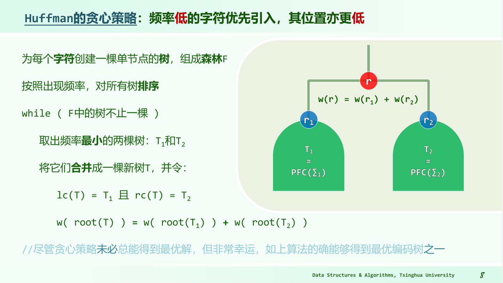

# 哈夫曼编码树

- 相关：[[哈夫曼树]]

- 动机：把最常用的字符编码为最短的
- 特点：是[[PFC]]编码，无歧义。
- 算法：将所有节点按频率排序，将频率最小的（$T_1$）当作左孩子，频率第二小的（$T_2$）当作右孩子，根节点是两个孩子的权重之和，由很多小树拼接成一棵大树。
- （2010 期中）在Huffman算法过程中，权重小的内部节点必然早于权重大的内部节点被创建。
    - 答案：正确。水木清研上说“可以用反证证得不是这样的编码树不是最优的”不过我目前还没证过。
