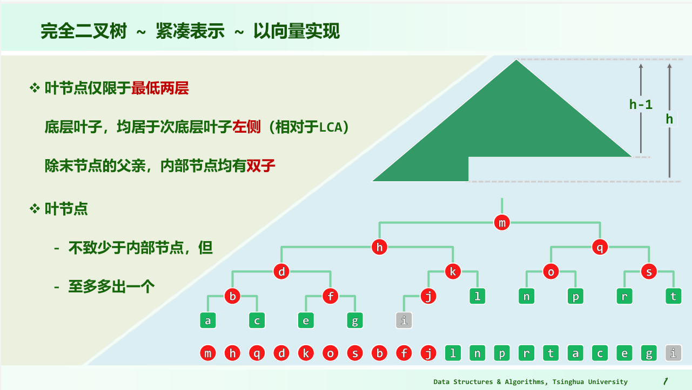
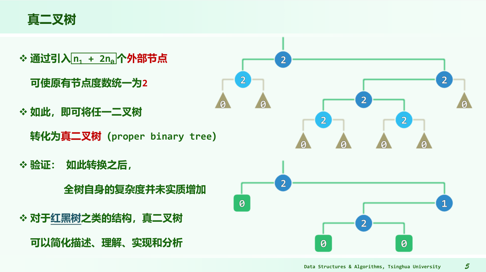

# 完全二叉树

- 
- 完全二叉树可以理解为满树的左下角多出一行**紧凑**的元素。
- 这一页PPT还有一个结论：叶节点不致少于内部节点，但至多多出一个。放到满树上也有类似的结论：满树的每一行的节点数就是这一行之上所有节点数+1。
- 完全二叉树和**真二叉树**（proper binary tree）不一样。
  - 对于任意树，通过引入 $n1 + 2n_0$ 个外部节点（想象单链的特殊情况，很容易记住）可使原有节点度数统一为2，即可将任一二叉树转化为真二叉树。
  - 
- 真题：（2010 期中）完全二叉树的子树也一定是完全二叉树
  - 正确。这个很容易理解。
