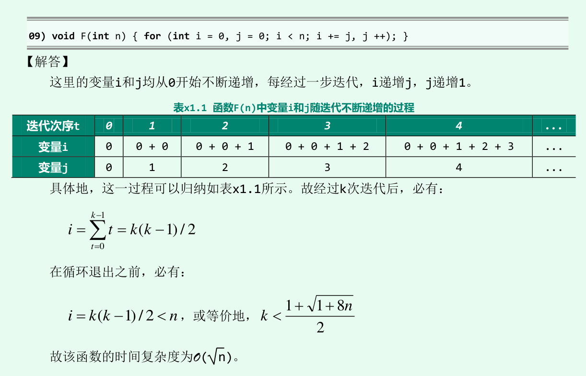

# 时间复杂度

- 定义：
  - 大O记号定义要点：存在c>0, 对任意n>>2，都有cf(n)>T(n).只是一个单纯的大小关系而已，比极限的定义要简单得多.
- 运算规则：

- 相关级数：

- （2011 期中）若 $f(n)=O(n^2)$ 且 $g(n) = O(n)$ 则下列结论正确的是
  - A. $f(n)+g(n)=O(n^2)$ 
  - B. $f(n)/g(n)=O(n^2)$ 
  - C. $g(n)=O(f(n))$ 
  - D. $f(n)*g(n)=O(n^3)$
  - 答案：
    - 这个运算只要能明确概念，然后根据概念找到极端反例即可。A正确，可联想等价无穷小的运算。B可举反例： $f(n)=1,g(n)=\frac 1 {n^3} = O(n^3), f(n)/g(n)=n^3\neq O(n^3)$ C可举反例 $g(n)=n,f(n)=1$. D正确（见运算规则9.26）

- （2011 期中）f(n) = O(g(n))，当且仅当g(n) =Ω(f(n))。
  - 答案：正确。可从定义看出。

- （2011 期中）估计以下函数F(n)的复杂度(假定int 类型字长无限，且递归不会溢出)
  - 答案：
    - (1) $\sqrt n$，因为i的迭代是以平方的形式增长的，但却被一个常数n限制，故为平方的反函数。详细解答：
    - (2) ：
      - 
      - 
      - 可以发现解题步骤：按迭代次序列表，写出迭代次序和N的表达式，反解出N的表达式
    - (3): 
    - (4): 习题解析嫌这样还不够难，把题目的叙述方式改得更恶心了，不过解题思路是一样的
    - (5)：
    - (6)：这题出得太野了受不了了，不过计算的方法之前都碰到过。不过，考试的时候如果碰见这种题然后分值又非常低，建议最后再算。
      - 这里有个结论：$a^{\log _b c} = c^{\log _b a}$
    - (7)：关键点是明白语义。这句话搞不懂“同样地请注意，G()最大的递归深度为 $2^m$ ”先放着不管。
    - (8)：

- （2014 期中）即使f(n)=O(g(n))也未必$2^{f(n)}=O(2^{g(n)})$
  - 答案：正确。用定义来推的话，如果f(n)=O(g(n))定义里面存在的常数c是大于1的，就没法推出 $2^{f(n)}=O(2^{g(n)})$ 。水木清研用的是举反例，我觉得更好。反例如下：f(n)=2n=O(4n)，在一次函数下常数可以抹掉，但是指数函数的底显然不能也这样抹掉： $2^{2n} =4^n \neq O(2^n)$ . 

- （2019 912）$n^{\log \log \log n} = O(\lfloor \log n \rfloor !)$
  - 答案：正确。解题思路是，两边取对数后在进行比较。注意用到了对数级数的性质。
