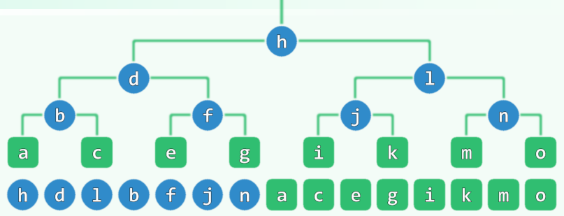

# 树

## 数学结论
- “深度”和“高度”的定义符合几何直观。“深度”是从树根到节点计算的（联想成语“根深蒂固”进而联想到树根），而高度是从高处往低处计算的（联想到词语“高楼大厦”）二者的计数单位都是边的数量。 此外，单个节点组成的树中，这个孤独的节点的深度和高度都是0
- 深度为k的节点，至多$2^k$个.
  - 以下图为例：
    
    h 深度为0，至多$2^0=1$个.
    b,f,j,n 深度为2，至多$2^2=4$个.

- n个节点、高h的二叉树满足<br>$h+1\leq n \leq 2^{h+1}-1$
  - 其中，高$h$指的是根节点到叶节点的边数的最大值。比如图中h-d-b-a是三条边，树的高度是3.又如，空树的高度是-1，单个节点的高度是0.
  - 这个不等式有两个极端情况：
    - $n = h + 1$：退化为一条单链
      - 这么理解：h是边的数量，边+1就是节点的数量。
    - $n = 2^{h+1} - 1$：即所谓**满二叉树**。可以理解为“没有空位”的二叉树。
  - **真题**：（2010 期中）所有叶节点深度一致的有根二叉树，必为满树。
    - 错误。叶节点深度一致的有根二叉树还是可以找到“空位”的。比如
        ```mermaid
        graph TB;
            A --> B
            A --> C
            B --> D
            B --> F(空位)
            C --> E
            C --> G(空位)
        ```

